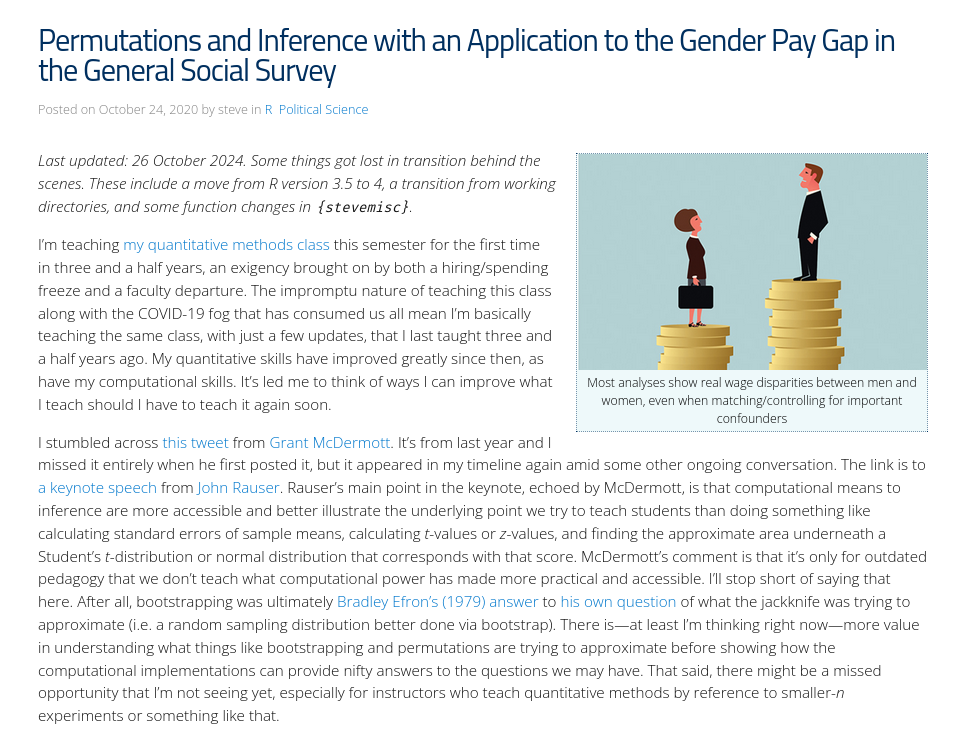

```{r setup, include=FALSE, cache=F, message=F, warning=F, results="hide"}
knitr::opts_chunk$set(cache=F, warning=F, message=F, echo = F)
knitr::opts_chunk$set(fig.path='figs/',  fig.width=14, fig.height=8.5)
knitr::opts_chunk$set(cache.path='cache/')
knitr::opts_chunk$set(cache.path='cache/',
                      collapse = TRUE, comment = "#>")

knitr::opts_chunk$set(
                  fig.process = function(x) {
                      x2 = sub('-\\d+([.][a-z]+)$', '\\1', x)
                      if (file.rename(x, x2)) x2 else x
                      }
                  )
```

```{r loaddata, echo=F, eval=T, message=F, warning=F}

library(tidyverse)
library(stevemisc)
library(stevethemes)
library(stevedata)
library(stargazer)
library(modelsummary)
library(kableExtra)
library(lmtest)
library(patchwork)
library(simqi)
library(tinytable)
library(qs2)
library(ggcorrplot)

options("modelsummary_format_numeric_latex" = "plain")
options(knitr.kable.NA = '')

fpsimex <- readRDS("~/Koofr/teaching/eh1903-ir3/2/bivariate-analysis/fpsim-example.rds")
dd <- qs_read("~/Koofr/projects/fpsim/docs/data/FPSIMVSU.qs") %>%
  bind_rows() %>% filter(year == 1991)

GSSW <- read_tsv("~/Koofr/teaching/eh1903-ir3/2/bivariate-analysis/gss-wage-sample-25-2018.tsv")


FPSIM <- readRDS("~/Koofr/svmiller.github.io/R/peacesciencer/dyadic_fp_similarity.rds")
# 
# FPSIM %>% filter(ccode2 > ccode1) %>%
#   filter(year == max(year)) %>% head(5) %>% data.frame

set.seed(8675309)
```

# Introduction
### Goal(s) for Today

1. Introduce basic measures of association for lower levels of measurement.
2. Give some applied examples in IR and economics.


# Bivariate Analysis
## Measures of Association for Nominal Data
### Measures of Association for Nominal Data

Measures of association for nominal data vary whether the data are 2x2 or not.

\bigskip

```{r}
tribble(~d, ~x1, ~x2,
        "A = 0", "a", "b",
        "A = 1", "c", "d") -> tbt


attr(tbt$d, "label") <- ""
attr(tbt$x1, "label") <- "B = 0"
attr(tbt$x2, "label") <- "B = 1"

tbt %>%
  tt(., caption = "A Simple 2x2 Contingency Table",
     colnames = "label",
     width = .5)  %>%
  style_tt(j = 1, bold = TRUE) %>%
  style_tt(i = 0, bold = TRUE)
```


### Measures of Association for 2x2 Nominal Comparisons

1. **Yule's Q**: $\frac{(ad  - bc)}{(ad + bc)}$
2. **Odds Ratio**: $\frac{ad}{bc}$
3. **Phi**: $\frac{ad - bc}{\sqrt{(a + b)(c + d)(a + c)(b + d)}}$

When the number of rows and columns are greater than two:

- Cramer's V
- Contingency coefficient

I'd belabor these more, but both lean on the $\chi^2$ statistic.

## The Chi-squared Test
### The Chi-squared Test

The Chi-squared ($\chi^2$) test is a staple in pedagogical instruction.

- Formally: a test for "independence" of observed and expected counts.
- Scales well no matter the number of rows and columns.

The test communicates whether observed counts for two or more groups are discernibly different than what could be expected by chance. Formally:

$$
\chi^2 = \sum \frac{(O - E)^2}{E}
$$

...where *O* is observed counts and *E* is expected counts.

### The Null Hypothesis

These types of tests have explicit "null" hypotheses.

- $H_0$: the two categorical variables are independent (i.e. not associated).
- $H_1$: the two categorical variables are associated with each other (i.e. not independent).

The tests you do under these conditions compare what you observe with what would be expected if the null were true.

- Greater incompatibility of the test stat with some distribution -> reject the null as unlikely to be true.

### By Way of a Blog Post...

{ width=80% }

### Table IX in Sample (1997)

{ width=70% }

###


```{r}
tribble(~d, ~ar, ~nar,
        "Escalation to War", 14, 17,
        "No Escalation", 39, 187) -> stix


attr(stix$d, "label") <- ""
attr(stix$ar, "label") <- "Arms Race"
attr(stix$nar, "label") <- "No Arms Race"

stix %>%
  tt(., caption = "Table IX in Sample (1997)",
     colnames = "label",
     width = .8)  %>%
  style_tt(j = 1, italic = TRUE) %>%
  style_tt(i = 0, italic = TRUE)
```

Btw...

\scriptsize

```{r, echo= TRUE}
(14*187 - 39*17)/(14*187 + 39*17) # Yule's Q
(14*187 - 39*17)/(sqrt((14 + 17)*(39 +187)*(14 + 39)*(17+187))) # Phi
```

\normalsize


###


```{r}
tribble(~d, ~ar, ~nar, ~rt,
        "Escalation to War", 14, 17, 31,
        "No Escalation", 39, 187, 226,
        "Column Total",  53, 204, 257) -> stix2


attr(stix2$d, "label") <- ""
attr(stix2$ar, "label") <- "Arms Race"
attr(stix2$nar, "label") <- "No Arms Race"
attr(stix2$rt, "label") <- "Row Total"

stix2 %>%
  tt(., caption = "Table IX in Sample (1997), with Row and Column Totals",
     colnames = "label",
     width = .8)  %>%
  style_tt(j = 1, italic = TRUE) %>%
  style_tt(i = 0, italic = TRUE) %>%
  style_tt(i = 3, bold = TRUE) %>%
  style_tt(j = 4, bold = TRUE)
```

###

```{r}
tribble(~d, ~ar, ~nar,
        "Escalation to War", "(31*53)/257 = **6.393**", "(31*204)/257 = **24.607**",
        "No Escalation", "(226*53)/257 = **46.607**", "(226*204)*257 = **179.393**") -> stix


attr(stix$d, "label") <- ""
attr(stix$ar, "label") <- "Arms Race"
attr(stix$nar, "label") <- "No Arms Race"

stix %>%
  tt(., caption = "Expected Counts in Table IX in Sample (1997)",
     colnames = "label",
     width = .85)  %>%
  style_tt(j = 1, italic = TRUE) %>%
  style_tt(i = 0, italic = TRUE) %>%
  format_tt(j =c(2,3), markdown = TRUE)
```

###

```{r}
tribble(~d, ~ar, ~nar,
        "Escalation to War", "(14 - 6.393)^2/(6.393) = **9.051**", "(17 - 24.607)^2/(24.607) = **2.351**",
        "No Escalation", "(39 - 46.607)^2/(46.607) = **1.241**", "(187 - 179.393)^2/(179.393) = **.322**") -> stix


attr(stix$d, "label") <- ""
attr(stix$ar, "label") <- "Arms Race"
attr(stix$nar, "label") <- "No Arms Race"

stix %>%
  tt(., caption = "Chi-Squares in Table IX in Sample (1997)",
     colnames = "label",
     width = .85)  %>%
  style_tt(j = 1, italic = TRUE) %>%
  style_tt(i = 0, italic = TRUE) %>%
  format_tt(j =c(2,3), markdown = TRUE)
```

Sum those up and you get your $\chi^2$ (i.e. 12.967).

### Inference in a Chi-square Test

Inference about the test statistic is compared to its eponymous distribution.

- This is a distribution of squared standard normal variables with just one parameter ($k$).
- $k$: the number of squared standard normal variables to summarize.

###

```{r}
set.seed(8675309)
tibble(x = rchisq(10000, 1)) %>%
  ggplot(.,aes(x)) +
  geom_density() +
  theme_steve() +
  geom_vline(xintercept = 12.967, linetype = 'dashed') +
  labs(x = "Chi-Square Distribution with a Degree of Freedom",
       y = "Density",
       title = "Comparing Sample's (1997) Chi-square Stat with What Could Be Expected Under No Association",
       caption = "Distribution is simulated for presentation's sake.",
       subtitle = "Our test statistic is a near impossibility if there were truly no differences between groups, per the chi-squared test and distribution.")
```

## Measures of Association for Ordinal Comparisons
### Measures of Association for Ordinal Comparisons

You might still see some of these in the wild, especially for assessing "foreign policy similarity".

- **Spearman's rho**: rank-based analog to Pearson's *r* correlation.
- **Kendall's Tau(-b)**: assesses probability of concordance/discordance.
- **Signorino and Ritter's (1999) S**: measures a kind of "distance" or similarity between pairs.
- **Cohen's (1968) kappa**: measures a "reliability" of coders
    - Older versions of the measure, like **Scott's (1955) pi** work with nominal data too.

###

```{r}
# full_join(fpsimex, dd) %>%
#   select(kvotev, pvotev, tvotev, svotevua) %>%
#   na.omit %>%
#   cor(.) -> AA
# 
# row.names(AA) <- colnames(AA) <- c("Cohen's\nKappa", "Scott's\npi", "Kendall's\nTau-b", "S&R's\nS")

FPSIM %>% 
  filter(year == 1816) %>% 
  filter(ccode2 > ccode1) %>% select(taub:piba) %>% cor(.) -> AA

rownames(AA) <- colnames(AA) <- c("Tau-b", "S (USV)", "S (WSV)",
                                  "S (UAV)", "S (WAV)",
                                  "Kappa (V)", "Pi (V)",
                                  "S (UAB)", "S (WAB)", "Kappa (B)",
                                  "Pi (B)")

ggcorrplot(AA, method = 'square',
           lab = TRUE, type = 'lower',
           colors = c("#E46726", "white", "#6D9EC1")) +
  theme_steve() +
  labs(title = "A Correlation Matrix of Various Measures of Foreign Policy Similarity in 1816",
       x = "", y = "",
       caption = "Data: Häge (2011). Data are for CoW alliances.\nU or W determines whether the S stat is weighted by capabilities.\nA or S determines whether the S stat is absolute or squared distances.\nB or V, for multiple measures, communicates whether the alliances are treated as ordinal or binary.",
       subtitle = "Notice these measures are not substitutable. More on Pearson's r later.")
```

## Measures of Association for Continuous Data
### Measures of Association for Continuous Data

**Pearson's correlation coefficient** (or **Pearson's *r***) will tell us how strongly two things travel together.

$$
    \frac{\Sigma(\frac{x_i - \overline{x}}{s_x})(\frac{y_i - \overline{y}}{s_y})}{n - 1}
$$

...where:

- $x_i$, $y_i$ = individual observations of *x* or *y*, respectively.
- $\overline{x}$, $\overline{y}$ = means of *x* and *y*, respectively.
- $s_x$, $s_y$ = standard deviations of *x* and *y*, respectively.
- *n* = number of observations in the sample.

### Properties of Pearsons *r*

1. Pearson's *r* is symmetrical.
2. Pearson's *r* is bound between -1 and 1.
3. Pearson's *r* is standardized.

###

```{r}
corn1 <- smvrnorm(50, mu = c(0,0), sigma = matrix(c(1,-1,-1,1), ncol = 2),
               empirical = TRUE, seed=8675309) %>% as_tibble() %>% mutate(cat = "Perfect Negative Correlation (-1)")

corn9 <- smvrnorm(50, mu = c(0,0), sigma = matrix(c(1,-.9,-.9,1), ncol = 2),
               empirical = TRUE, seed=8675309) %>% as_tibble() %>% mutate(cat = "Very Strong Negative Correlation (-.9)")
 
corn5 <- smvrnorm(50, mu = c(0,0), sigma = matrix(c(1,-.5,-.5,1), ncol = 2),
               empirical = TRUE, seed=8675309) %>% as_tibble() %>% mutate(cat = "Moderate Negative Correlation (-.5)")

cor0 <- smvrnorm(50, mu = c(0,0), sigma = matrix(c(1,0,0,1), ncol = 2),
               empirical = TRUE, seed=8675309) %>% as_tibble() %>% mutate(cat = "No Correlation (0)")


corp1 <- smvrnorm(50, mu = c(0,0), sigma = matrix(c(1,1,1,1), ncol = 2),
               empirical = TRUE, seed=8675309) %>% as_tibble() %>% mutate(cat = "Perfect Positive Correlation (1)")

corp9 <- smvrnorm(50, mu = c(0,0), sigma = matrix(c(1,.9,.9,1), ncol = 2),
               empirical = TRUE, seed=8675309) %>% as_tibble() %>% mutate(cat = "Very Strong Positive Correlation (.9)")
 
corp5 <- smvrnorm(50, mu = c(0,0), sigma = matrix(c(1,.5,.5,1), ncol = 2),
               empirical = TRUE, seed=8675309) %>% as_tibble() %>% mutate(cat = "Moderate Positive Correlation (.5)")

bind_rows(corn1, corn9, corn5, cor0,
          corp5, corp9, corp1) %>%
  mutate(cat = fct_inorder(cat)) %>%
  ggplot(.,aes(V1, V2)) + geom_point() + geom_smooth(method = "lm") +
  facet_wrap(~cat) +
  theme_steve_web() +
  labs(x = "Hypothetical X Variable", y = "Hypothetical Y Variable",
       title = "Various Linear Patterns You Could Deduce from a Scatterplot",
       subtitle = "Do note: you can describe these correlations however you want. There is no formal metric, beyond direction, perfection, and zero.",
       caption = "Data: Simulated with smvrnorm() in {stevemisc} package.")
```

## The t-test
### Comparing Two Means of Two Groups

The (Welch-Satterthwaite) *t*-test (for unequal variances) is ubiquitous as well.

- The experimentalists love to use it when they can (so do clinical researchers).


Assumptions: 

- Sample means being compared come from normally distributed population.
- Independence between/within groups being compared.
- Measures are continuous (i.e. you have means).

There are variants of the *t*-test, but we'll generally assume you mean this particular one.


### The Formula for Welch-Satterthwaite's *t*-test

$$
 t = \frac{\overline{X}_1 - \overline{X}_2}{\sqrt{ {s_{\bar{X}_1}^2} + {s_{\bar{X}_2}^2} }},
$$

where...

$$
s_{\bar{X}_i} = \frac{s_i}{\sqrt{N_i}}
$$

and...

$$
 \nu \approx
 \frac{\left(\frac{s_1^2}{N_1} + \frac{s_2^2}{N_2}\right)^2}
      {\frac{s_1^4}{N_1^2 \nu_1} + \frac{s_2^4}{N_2^2 \nu_2}},
$$


###


###


###


### IRII.3 Students May Remember This...


### By Way of Another Blog Post...



### The Gender Pay Gap (in the U.S.)

We'll explore the gender pay gap in the U.S. with a simple data set from 2018.

- These are Americans in 2018, between 18-25, who have never been married, have no kids, are not in school (but finished high school).
- Respondent's base income (`realrinc`) is in 1986 USD.

Those of you who remember me from IRII.3 will have seen this before.

- I've uploaded relevant materials to Athena for those that haven't.
- I'd love to get something similar from SOM for Swedes, but I keep getting told no. :(

### The Null Hypothesis

Again, this is another "reject the null" type of test.

- $H_0$: the two means are equal to each other
- $H_1$: the two means are not equal to each other (or one is greater).

Like the $\chi^2$ test, you compare the test statistic to what could be expected if $H_0$ is true.

- Greater incompatibility of the test stat with some distribution -> reject the null.
- Assert $H_1$ is closer to what's true.

###

\scriptsize
```{r,echo=T}
t.test(realrinc ~ gender, GSSW)
```

\normalsize

### Inference in a t-test

Like the chi-squared test, the *t*-stat is compared to a hypothetical distribution with some degrees of freedom.

- This is about 46.208, in our case.
- It also has an important mean parameter (0 [for no differences] in this case).

Pertinent features of the *t*-distribution:

- Fewer degrees of freedom -> longer tails.
- More degrees of freedom - > shorter, "normal" tails.
- Rule of thumb: the *t*-distribution approaches the familiar bell curve at 30 degrees of freedom.
- Like the normal distribution, it too is symmetrical around its mean.

###

```{r}
tibble(x = rt(10000, 46.208)) %>%
  ggplot(.,aes(x)) +
  theme_steve() +
  geom_density() +
  geom_vline(xintercept = -3.3188, linetype = 'dashed') +
    labs(x = "Student's t Distribution with 46.208 Degrees of Freedom",
       y = "Density",
       title = "Comparing our *t*-stat with What Could Be Expected if There Were No Differences Between Men and Women",
       caption = "Distribution is simulated for presentation's sake.",
       subtitle = "Our test statistic is a near impossibility if there were truly no differences between men and women in their wages, per the *t*-distribution.")
```

# Conclusion
### Conclusion

There's more in here that you'll need, but some things to consider:

- Most of your measures of association/correlation are "symmetric".
- Many bivariate measures of association have boutique uses, but you might see some of them in the wild.
    - i.e. dyadic foreign policy similarity has long been measured with them (for better or worse).
- Know the chi-squared distribution; it'll recur in several quadratic-form tests.
    - Prominently: Breusch-Pagan, Lagrange multipliers, Box-Pierce, Hausman, and more.
- Know the *t*-distribution; it's the one you'll be seeing the most at the intro-level.
    - It's normal-like, but has that important degrees of freedom parameter.
- Notice the inference you're making.
    - i.e. "what is plausible, given some distribution? Is my test statistic consistent with it?"