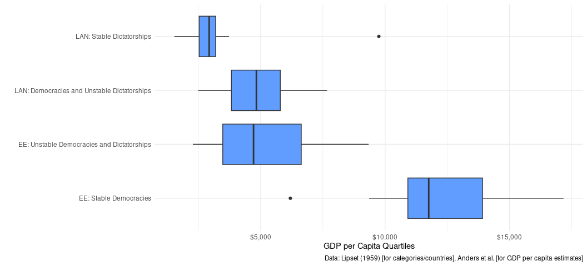

``` r

#   ____
#  (.   \
#    \  |  
#     \ |___(\--/)
#   __/    (  . . )
#  "'._.    '-.O.'
#       '-.  \ "|\
#          '.,,/'.,, Correlation (Pearson's r)
```

## If it’s not installed, install it.

``` r
library(tidyverse)
#> ── Attaching core tidyverse packages ──────────────────────── tidyverse 2.0.0 ──
#> ✔ dplyr     1.1.4     ✔ readr     2.1.4
#> ✔ forcats   1.0.0     ✔ stringr   1.5.0
#> ✔ ggplot2   4.0.0     ✔ tibble    3.3.0
#> ✔ lubridate 1.9.4     ✔ tidyr     1.3.0
#> ✔ purrr     1.1.0     
#> ── Conflicts ────────────────────────────────────────── tidyverse_conflicts() ──
#> ✖ dplyr::filter() masks stats::filter()
#> ✖ dplyr::lag()    masks stats::lag()
#> ℹ Use the conflicted package (<http://conflicted.r-lib.org/>) to force all conflicts to become errors
library(stevemisc)
#> 
#> Attaching package: 'stevemisc'
#> 
#> The following object is masked from 'package:lubridate':
#> 
#>     dst
#> 
#> The following object is masked from 'package:dplyr':
#> 
#>     tbl_df
library(stevethemes) # Optional; gonna use it anyway

theme_set(theme_steve(style = 'generic'))
```

Please read this:

- <http://svmiller.com/blog/2023/09/democracy-income-correlation-analysis/>

It should not be difficult to follow along with the overall scope of
this analysis and the broader context in which it occurs.

## Load and prepare the data

On Athena, I uploaded the data as an Excel file. You can download that
data to your working directory and load into your session as follows.
Here, I have to impress upon you that we have only so much time together
so I have to assume some preliminary knowledge with file structures.

``` r
#Data <- readxl::read_excel("Lipset59.xlsx")

# ALTERNATIVELY, which I'll do here:

Data <- readr::read_csv("http://svmiller.com/extdata/democracy-income-1950.csv")
#> Rows: 48 Columns: 8
#> ── Column specification ────────────────────────────────────────────────────────
#> Delimiter: ","
#> chr (3): country, iso3c, cat
#> dbl (5): wbgdp2011est, wbpopest, v2x_polyarchy, polity2, xm_qudsest
#> 
#> ℹ Use `spec()` to retrieve the full column specification for this data.
#> ℹ Specify the column types or set `show_col_types = FALSE` to quiet this message.

# Or...

# Data <- stevedata::Lipset59
```

Let’s see what these data look like.

``` r
Data
#> # A tibble: 48 × 8
#>    country    iso3c cat   wbgdp2011est wbpopest v2x_polyarchy polity2 xm_qudsest
#>    <chr>      <chr> <chr>        <dbl>    <dbl>         <dbl>   <dbl>      <dbl>
#>  1 Australia  AUS   EE: …      1.12e11   8.07e6         0.782      10       1.87
#>  2 Belgium    BEL   EE: …      7.75e10   8.29e6         0.685      10       1.85
#>  3 Canada     CAN   EE: …      1.79e11   1.33e7         0.75       10       1.52
#>  4 Denmark    DNK   EE: …      4.66e10   4.09e6         0.896      10       1.58
#>  5 Ireland    IRL   EE: …      1.77e10   2.86e6         0.801       8       1.20
#>  6 Luxembourg LUX   EE: …      4.16e 9   2.85e5         0.832      10       1.75
#>  7 Netherlan… NLD   EE: …      9.28e10   9.64e6         0.791      10       1.71
#>  8 New Zeala… NZL   EE: …      2.48e10   1.82e6         0.795      10       1.85
#>  9 Norway     NOR   EE: …      3.44e10   3.15e6         0.803      10       1.71
#> 10 Sweden     SWE   EE: …      7.87e10   6.70e6         0.767      10       1.79
#> # ℹ 38 more rows
```

I want to keep things nice and simple for this exercise and avoid the
somewhat convoluted file names (for beginners). Here is where I have to
impress upon you to read the above-linked blog post that’s on my website
for a description of what the democracy indicator is communicating. One
thing I’ll know I’ll have to do is create a variable for GDP per capita.
I have data on GDP, and I have data on population size. I just have to
divide one over the other.

Ideally, you can tease out what’s happening in this sequence of
commands.Any volunteers to elaborate what’s happening here?

``` r
Data %>%
  mutate(gdppc = wbgdp2011est/wbpopest) %>%
  select(country:cat, xm_qudsest, gdppc) %>%
  rename(demest = xm_qudsest) -> Data

Data
#> # A tibble: 48 × 5
#>    country     iso3c cat                    demest  gdppc
#>    <chr>       <chr> <chr>                   <dbl>  <dbl>
#>  1 Australia   AUS   EE: Stable Democracies   1.87 13919.
#>  2 Belgium     BEL   EE: Stable Democracies   1.85  9358.
#>  3 Canada      CAN   EE: Stable Democracies   1.52 13413.
#>  4 Denmark     DNK   EE: Stable Democracies   1.58 11384.
#>  5 Ireland     IRL   EE: Stable Democracies   1.20  6192.
#>  6 Luxembourg  LUX   EE: Stable Democracies   1.75 14589.
#>  7 Netherlands NLD   EE: Stable Democracies   1.71  9633.
#>  8 New Zealand NZL   EE: Stable Democracies   1.85 13602.
#>  9 Norway      NOR   EE: Stable Democracies   1.71 10916.
#> 10 Sweden      SWE   EE: Stable Democracies   1.79 11755.
#> # ℹ 38 more rows
```

## Basic descriptive statistics

I refer you again to the blog post, but Lipset (1959) groups these 48
countries into four categories. These are admittedly clumsy, but the
four groups are stable democracies in Europe and the English-speaking
world (EE), unstable democracies and dictatorships in the same,
democracies and unstable dictatorships among Latin American Nations
(LAN), and stable dictatorships in the same.

``` r
# As verification:
Data %>%
  distinct(cat)
#> # A tibble: 4 × 1
#>   cat                                        
#>   <chr>                                      
#> 1 EE: Stable Democracies                     
#> 2 EE: Unstable Democracies and Dictatorships 
#> 3 LAN: Democracies and Unstable Dictatorships
#> 4 LAN: Stable Dictatorships

# To see who is grouped into what:

Data %>%
  group_split(cat)
#> <list_of<
#>   tbl_df<
#>     country: character
#>     iso3c  : character
#>     cat    : character
#>     demest : double
#>     gdppc  : double
#>   >
#> >[4]>
#> [[1]]
#> # A tibble: 13 × 5
#>    country        iso3c cat                    demest  gdppc
#>    <chr>          <chr> <chr>                   <dbl>  <dbl>
#>  1 Australia      AUS   EE: Stable Democracies   1.87 13919.
#>  2 Belgium        BEL   EE: Stable Democracies   1.85  9358.
#>  3 Canada         CAN   EE: Stable Democracies   1.52 13413.
#>  4 Denmark        DNK   EE: Stable Democracies   1.58 11384.
#>  5 Ireland        IRL   EE: Stable Democracies   1.20  6192.
#>  6 Luxembourg     LUX   EE: Stable Democracies   1.75 14589.
#>  7 Netherlands    NLD   EE: Stable Democracies   1.71  9633.
#>  8 New Zealand    NZL   EE: Stable Democracies   1.85 13602.
#>  9 Norway         NOR   EE: Stable Democracies   1.71 10916.
#> 10 Sweden         SWE   EE: Stable Democracies   1.79 11755.
#> 11 Switzerland    CHE   EE: Stable Democracies   1.01 16188.
#> 12 United Kingdom GBR   EE: Stable Democracies   1.90 11696.
#> 13 United States  USA   EE: Stable Democracies   1.27 17171.
#> 
#> [[2]]
#> # A tibble: 15 × 5
#>    country        iso3c cat                                        demest gdppc
#>    <chr>          <chr> <chr>                                       <dbl> <dbl>
#>  1 Austria        AUT   EE: Unstable Democracies and Dictatorships  1.79  6330.
#>  2 Bulgaria       BGR   EE: Unstable Democracies and Dictatorships -0.460 3245.
#>  3 Czechoslovakia CSK   EE: Unstable Democracies and Dictatorships -0.504 6242.
#>  4 Finland        FIN   EE: Unstable Democracies and Dictatorships  1.58  7503.
#>  5 France         FRA   EE: Unstable Democracies and Dictatorships  1.58  8769.
#>  6 West Germany   DEU   EE: Unstable Democracies and Dictatorships  1.69  6933.
#>  7 Greece         GRC   EE: Unstable Democracies and Dictatorships  0.606 3432.
#>  8 Hungary        HUN   EE: Unstable Democracies and Dictatorships -0.485 4670.
#>  9 Iceland        ISL   EE: Unstable Democracies and Dictatorships  1.74  9339.
#> 10 Italy          ITA   EE: Unstable Democracies and Dictatorships  1.78  5558.
#> 11 Poland         POL   EE: Unstable Democracies and Dictatorships -0.411 4713.
#> 12 Portugal       PRT   EE: Unstable Democracies and Dictatorships -0.634 3519.
#> 13 Romania        ROU   EE: Unstable Democracies and Dictatorships -0.485 2276.
#> 14 Spain          ESP   EE: Unstable Democracies and Dictatorships -0.590 4040.
#> 15 Yugoslavia     YUG   EE: Unstable Democracies and Dictatorships -0.512 2893.
#> 
#> [[3]]
#> # A tibble: 7 × 5
#>   country    iso3c cat                                         demest gdppc
#>   <chr>      <chr> <chr>                                        <dbl> <dbl>
#> 1 Argentina  ARG   LAN: Democracies and Unstable Dictatorships  0.266 5750.
#> 2 Brazil     BRA   LAN: Democracies and Unstable Dictatorships  0.797 2485.
#> 3 Chile      CHL   LAN: Democracies and Unstable Dictatorships  0.694 5825.
#> 4 Colombia   COL   LAN: Democracies and Unstable Dictatorships -0.116 3835.
#> 5 Costa Rica CRI   LAN: Democracies and Unstable Dictatorships  1.01  3809.
#> 6 Mexico     MEX   LAN: Democracies and Unstable Dictatorships -0.155 4827.
#> 7 Uruguay    URY   LAN: Democracies and Unstable Dictatorships  0.827 7669.
#> 
#> [[4]]
#> # A tibble: 13 × 5
#>    country            iso3c cat                        demest gdppc
#>    <chr>              <chr> <chr>                       <dbl> <dbl>
#>  1 Bolivia            BOL   LAN: Stable Dictatorships -0.128  3020.
#>  2 Cuba               CUB   LAN: Stable Dictatorships  0.780  3726.
#>  3 Dominican Republic DOM   LAN: Stable Dictatorships -0.719  2173.
#>  4 Ecuador            ECU   LAN: Stable Dictatorships  0.665  2805.
#>  5 El Salvador        SLV   LAN: Stable Dictatorships -0.195  1527.
#>  6 Guatemala          GTM   LAN: Stable Dictatorships  0.605  3156.
#>  7 Haiti              HTI   LAN: Stable Dictatorships -0.100  1918.
#>  8 Honduras           HND   LAN: Stable Dictatorships  0.0495 2525.
#>  9 Nicaragua          NIC   LAN: Stable Dictatorships -0.547  3648.
#> 10 Panama             PAN   LAN: Stable Dictatorships  0.283  2928.
#> 11 Paraguay           PRY   LAN: Stable Dictatorships -0.181  2689.
#> 12 Peru               PER   LAN: Stable Dictatorships  0.0455 3191.
#> 13 Venezuela          VEN   LAN: Stable Dictatorships -0.119  9750.
```

Lipset (1959) observes that there is something he thinks is interesting
among these countries. The exact values are going to necessarily vary
(because we’re using different data than him) but he observes the
poorest stable democracy in the EE group is just about as rich as the
richest unstable democracy in the same group. He finds the overlap among
the Latin American states to be much closer, but that the more
democratic states are on the balance richer.

We can use the following code to see what he saw.

``` r
Data %>%
  summarize(min = min(gdppc),
            median = median(gdppc),
            mean = mean(gdppc),
            max = max(gdppc), .by=cat)
#> # A tibble: 4 × 5
#>   cat                                           min median   mean    max
#>   <chr>                                       <dbl>  <dbl>  <dbl>  <dbl>
#> 1 EE: Stable Democracies                      6192. 11755. 12294. 17171.
#> 2 EE: Unstable Democracies and Dictatorships  2276.  4713.  5297.  9339.
#> 3 LAN: Democracies and Unstable Dictatorships 2485.  4827.  4886.  7669.
#> 4 LAN: Stable Dictatorships                   1527.  2928.  3312.  9750.

# Alternatively, if you were feeling fancy...

group_split(Data, cat) %>%
  setNames(unique(Data$cat)) %>%
  map(., ~summary(., gdppc))
#> $`EE: Stable Democracies`
#>    country             iso3c               cat                demest     
#>  Length:13          Length:13          Length:13          Min.   :1.005  
#>  Class :character   Class :character   Class :character   1st Qu.:1.519  
#>  Mode  :character   Mode  :character   Mode  :character   Median :1.713  
#>                                                           Mean   :1.615  
#>                                                           3rd Qu.:1.848  
#>                                                           Max.   :1.899  
#>      gdppc      
#>  Min.   : 6192  
#>  1st Qu.:10916  
#>  Median :11755  
#>  Mean   :12294  
#>  3rd Qu.:13919  
#>  Max.   :17171  
#> 
#> $`EE: Unstable Democracies and Dictatorships`
#>    country             iso3c               cat                demest       
#>  Length:15          Length:15          Length:15          Min.   :-0.6344  
#>  Class :character   Class :character   Class :character   1st Qu.:-0.4945  
#>  Mode  :character   Mode  :character   Mode  :character   Median :-0.4109  
#>                                                           Mean   : 0.4450  
#>                                                           3rd Qu.: 1.6327  
#>                                                           Max.   : 1.7880  
#>      gdppc     
#>  Min.   :2276  
#>  1st Qu.:3476  
#>  Median :4713  
#>  Mean   :5297  
#>  3rd Qu.:6631  
#>  Max.   :9339  
#> 
#> $`LAN: Democracies and Unstable Dictatorships`
#>    country             iso3c               cat                demest        
#>  Length:7           Length:7           Length:7           Min.   :-0.15521  
#>  Class :character   Class :character   Class :character   1st Qu.: 0.07506  
#>  Mode  :character   Mode  :character   Mode  :character   Median : 0.69395  
#>                                                           Mean   : 0.47433  
#>                                                           3rd Qu.: 0.81168  
#>                                                           Max.   : 1.00812  
#>      gdppc     
#>  Min.   :2485  
#>  1st Qu.:3822  
#>  Median :4827  
#>  Mean   :4886  
#>  3rd Qu.:5788  
#>  Max.   :7669  
#> 
#> $`LAN: Stable Dictatorships`
#>    country             iso3c               cat                demest        
#>  Length:13          Length:13          Length:13          Min.   :-0.71942  
#>  Class :character   Class :character   Class :character   1st Qu.:-0.18118  
#>  Mode  :character   Mode  :character   Mode  :character   Median :-0.10025  
#>                                                           Mean   : 0.03375  
#>                                                           3rd Qu.: 0.28265  
#>                                                           Max.   : 0.78015  
#>      gdppc     
#>  Min.   :1527  
#>  1st Qu.:2525  
#>  Median :2928  
#>  Mean   :3312  
#>  3rd Qu.:3191  
#>  Max.   :9750
```

It would be useful to visualize this to get a sense of the distribution.
There are (only slightly) more complicated techniques here that may get
more out of the visualization, but this should suffice.

``` r
ggplot(Data, aes(cat, gdppc)) +
  geom_boxplot(fill="#619cff") +
  # put your thing down flip it and reverse it...
  coord_flip() +
  # Be mindful of the coord_flip(), though...
  scale_y_continuous(labels = scales::dollar_format()) +
  labs(x = "", y="GDP per Capita Quartiles",
       caption = "Data: Lipset (1959) [for categories/countries], Anders et al. [for GDP per capita estimates]")
```

<!-- -->

Box plots are kind of blech, but you’re seeing basically what Lipset
(1959) saw. Democracies are almost always richer than non-democracies in
Europe. The difference is not as stark in Latin America—indeed, there
aren’t a lot of democracies out there at this point in time—but the
center of gravity is clearly different. Those two anomalous observations
you see—which box plot defaults identify as “extreme” observations—are
Ireland and Venezuela. I will defer to you to know why that’s the case.

## Correlation (Pearson’s *r*)

You were introduced to correlation in the last lecture, so let’s talk
about what correlation does. Correlation statistics are tools to help
you describe how closely two things travel together. There are a few
correlation statistics out there, and you might even encounter Kendall’s
tau or Spearman’s rho in the wild. However, the most common correlation
statistic for students in your position is Pearson’s *r* (which is used
largely for interval-level variables that you see here).

In lecture, you also saw the formula for calculating Pearson’s *r*.
Understand that its formula reveals three things about it.

### Symmetry

The first is that it’s symmetrical. The main action that happens in the
formula is multiplying (transformed, more on that later) values of x
with (transformed) values of y. You may remember from gymnasium that
multiplying x and y is equal to multiplying y and x, and that order only
matters for division and subtraction.

Let’s see what this looks like when applied. Of note: I don’t think
Swedes can easily access a dollar sign operator (I think it’s Alt Gr +
4, though). So, I’m doing it this way.

``` r
Data %>% summarize(cor = cor(demest, gdppc, use='complete.obs'))
#> # A tibble: 1 × 1
#>     cor
#>   <dbl>
#> 1 0.701
# Alternatively:
# cor(Data$demest, Data$gdppc, use='complete.obs')
```

In the above sequence, I’m starting with the data frame we created and
summarizing it into a single column data frame using, importantly, the
`cor()` function. In this function, democracy is treating as the x
variable and GDP per capita is treated as the y variable. The use
argument is optional in this context, but you may want to know about it.
It tells the `cor()` function to omit missing data if it finds it and
just use what’s available. That doesn’t matter in this simple case,
though it’s good to know about it.

We’ll unpack this statistic later, but I just want to emphasize one
thing here. In applied statistics, we often use “x” as a shorthand for
some type of causal variable and “y” as a shorthand for some kind of
response variable that is a function of the causal variable.
Alternatively: democracy *causes* GDP per capita. As I mention in the
blog post, this is a huge debate in the field because there is no
agreement about what causes what. It’s also amid this debate that we
should emphasize that correlation gives you no answer. Observe:

``` r
Data %>% summarize(cor = cor(gdppc, demest, use='complete.obs'))
#> # A tibble: 1 × 1
#>     cor
#>   <dbl>
#> 1 0.701
```

^ same statistic. Correlation is symmetrical and does not care about the
data-generating process that leads to x and y. y could be a function of
x, as an objective fact, or be artifacts of some other different
processes. Pearson’s *r* won’t care about the order.

### Bounds

The other feature of Pearson’s *r* that is worth belaboring is that it
is hard-bound to be between -1 and 1. If you calculated a Pearson’s *r*
of 1.04, you screwed up. The computer won’t make that mistake for you,
though.

One somewhat dissatisfying feature about the construction of Pearson’s
*r* is that there are very few objective rules for summarizing the
result of this statistic. What follows will omit a discussion of the
correlation test of significance (i.e. could you rule out 0) and focus
on the following objective rules for the summary of Pearson’s r.

1)  Direction: Pearson’s r could be either positive or negative.
    Positive means that we expect y to increase (decrease) as x
    increases (decreases). Negative means we expect y to increase
    (decrease) as x decreases (increases).
2)  Perfection: Pearson’s r statistics of -1 or 1 communicate perfect
    relationships. If Pearson’s r is 1, for example, an increase of 1 in
    x will result in some constant increase in y 100% of the time. Here,
    the data would look like some slope-intercept equation of y = mx +
    b, which you might remember from gymnasium. It’s an effective
    impossibility that you will find that in the wild, though. Noise is
    all around you.
3)  Zero: Pearson’s r statistics of 0 indicate no change whatsoever in y
    for any change in x. These are also rare in as much that we are
    talking about 0 with precision and ignoring a conversation about a
    test of significance against 0.

So where does that leave us with the Pearson’s r we got? You might see a
table, [like this
one](https://ir3-2.svmiller.com/images/pearson-r-table.png) or [this
one](https://ir3-2.svmiller.com/images/pearson-r-table-2.png), that
proposes a way of summarizing Pearson’s r with some combination of an
adverb and adjective. I will only caution this is a useful framework for
students and beginners, but it is not a rule. It’s not even worth
recommending, if I’m being honest. What you see is a Pearson’s r of .701
or so. That’s clearly positive, but it’s not perfect and it’s clearly
not 0. I would call it a strong positive relationship, but here you have
to use you words to describe anything that’s not perfect and not 0. Use
your head, but use your words.

### Standardization

Lecture gave you a preview of this, but one of the niftier things about
the Pearson’s *r* formula is that the numerator side of the equation is
creating *z*-scores, or standardizing both the x variable and y variable
to have a mean of 0 and a standard deviation of 1. Did you create
*z*-scores in gymnasium? I remember doing it in my AP Stats class in the
United States. Ever seen the standard normal distribution with the
bounds communicating 68-90-95-99-percent coverage? Also standardization.

To drive the point home, let’s create a standardized version of the
democracy and GDP per capita variable.

``` r
Data %>%
  r1sd_at(c("demest", "gdppc")) -> Data

Data
#> # A tibble: 48 × 7
#>    country     iso3c cat                    demest  gdppc s_demest s_gdppc
#>    <chr>       <chr> <chr>                   <dbl>  <dbl>    <dbl>   <dbl>
#>  1 Australia   AUS   EE: Stable Democracies   1.87 13919.    1.32   1.73  
#>  2 Belgium     BEL   EE: Stable Democracies   1.85  9358.    1.30   0.651 
#>  3 Canada      CAN   EE: Stable Democracies   1.52 13413.    0.944  1.61  
#>  4 Denmark     DNK   EE: Stable Democracies   1.58 11384.    1.01   1.13  
#>  5 Ireland     IRL   EE: Stable Democracies   1.20  6192.    0.600 -0.0948
#>  6 Luxembourg  LUX   EE: Stable Democracies   1.75 14589.    1.20   1.88  
#>  7 Netherlands NLD   EE: Stable Democracies   1.71  9633.    1.16   0.716 
#>  8 New Zealand NZL   EE: Stable Democracies   1.85 13602.    1.30   1.65  
#>  9 Norway      NOR   EE: Stable Democracies   1.71 10916.    1.15   1.02  
#> 10 Sweden      SWE   EE: Stable Democracies   1.79 11755.    1.24   1.22  
#> # ℹ 38 more rows
```

In the above console output, the s\_ prefix precedes the name of the
variable that was standardized into a new column. We know our
correlation coefficient is .701, suggesting a pretty strong, positive
relationship. We are expecting to see that most of the standardized
variables share the same sign. If it’s above the mean in democracy, we
expect it to be above the mean in per capita income. If it’s below the
mean in democracy, we expect it to be below the mean in per capita
income. Looking at just the first 10 observations, incidentally all in
Europe, we see exactly that. Nine of these 10 states are consistent with
this positive correlation, with just the one obvious exception of
Ireland. We kind of expected to observe that, and we did.

It’s helpful to unpack what this mean visually by way of our
scatterplot. We know that correlation creates z-scores of x and y
underneath the hood, so let’s draw a vertical line at the mean of
democracy and a horizontal line at the mean of per capita income to
gather more information about our data.

``` r
mean_gdppc <- mean(Data$gdppc)
mean_demest <- mean(Data$demest)

ggplot(Data, aes(demest, gdppc)) +
  geom_point() +
  geom_smooth(method ='lm') +
  geom_vline(xintercept = mean_demest, linetype = 'dashed') +
  geom_hline(yintercept = mean_gdppc, linetype = 'dashed') +
  scale_y_continuous(labels = scales::dollar_format())
#> `geom_smooth()` using formula = 'y ~ x'
```

<!-- -->

This is effectively breaking our bivariate data into quadrants. The
bottom-left and top-right quadrants are so-called positive correlation
quadrants. They are above (below) the mean in x and above (below) the
mean in y and their placement in this quadrant is consistent with a
positive correlation. The top-left and bottom-right quadrants are
so-called negative correlation quadrants. They are above (below) the
mean in x and below (above) the mean y, so observations here are
inconsistent with a positive correlation and consistent with a negative
correlation. The correlation coefficient we get implies that we should
expect to see the bulk of observations in the top-right and bottom-left
quadrants, which we incidentally do.

One thing this implies is that if we kept just those observations in the
top-left and bottom-right quadrants, the ensuing Pearson’s r would be
misleadingly (sic?) negative. Observe:

``` r
Data %>%
  mutate(quadrant = case_when(
    s_demest > 0 & s_gdppc > 0 ~ "Positive",
    s_demest < 0 & s_gdppc < 0 ~ "Positive",
    TRUE ~ "Negative"
  )) -> Data

Data %>% 
  filter(quadrant == "Negative") %>%
  summarize(cor = cor(demest, gdppc))
#> # A tibble: 1 × 1
#>      cor
#>    <dbl>
#> 1 -0.211
```

It’s helpful here to identify the observations that are inconsistent
with the positive correlation we observe. There are any number of ways
of doing this. The tibble gives us a preview, and helps us find Ireland,
though let’s find the whole gang of off-quadrant observations.

``` r
Data %>% 
  filter(quadrant == "Negative") 
#> # A tibble: 9 × 8
#>   country    iso3c cat                    demest gdppc s_demest s_gdppc quadrant
#>   <chr>      <chr> <chr>                   <dbl> <dbl>    <dbl>   <dbl> <chr>   
#> 1 Ireland    IRL   EE: Stable Democracies  1.20  6192.   0.600  -0.0948 Negative
#> 2 Austria    AUT   EE: Unstable Democrac…  1.79  6330.   1.24   -0.0624 Negative
#> 3 Italy      ITA   EE: Unstable Democrac…  1.78  5558.   1.23   -0.244  Negative
#> 4 Brazil     BRA   LAN: Democracies and …  0.797 2485.   0.155  -0.968  Negative
#> 5 Chile      CHL   LAN: Democracies and …  0.694 5825.   0.0428 -0.181  Negative
#> 6 Costa Rica CRI   LAN: Democracies and …  1.01  3809.   0.386  -0.656  Negative
#> 7 Cuba       CUB   LAN: Stable Dictators…  0.780 3726.   0.137  -0.676  Negative
#> 8 Ecuador    ECU   LAN: Stable Dictators…  0.665 2805.   0.0116 -0.893  Negative
#> 9 Venezuela  VEN   LAN: Stable Dictators… -0.119 9750.  -0.845   0.743  Negative
```

What you make of the observations requires some subject domain
expertise. You gotta know Ireland’s back story to understand why it’s at
this point in the 1950s. Go read about what Venezuela was doing at this
point in time (i.e. it was the Saudi Arabia of its day). Just because
those two observations are what they are doesn’t invalidate the overall
relationship we observe. Democracy and wealth are relatively robust and
stable equilibrium. However, we don’t know what causes what.

## Bonus: calculate your own Pearson’s *r*. It’s not hard!

``` r
sum(Data$s_demest*Data$s_gdppc)/(nrow(Data) - 1)
#> [1] 0.7008677
cor(Data$demest, Data$gdppc, use='complete.obs')
#> [1] 0.7008677

# ^ insert soyjaks pointing meme here.
```

Okay, fine, I’ll do it myself.

<div align="center">


</div>
