``` r
# =========================
# Lab 2: Data generation, measurement, and visualization
#
# Steven V. Miller (EH 1903)
# =========================
#   \
#     \
#       \
#           |\___/|
#         ==) ^Y^ (==
#           \  ^  /
#            )=*=(
#           /     \
#           |     |
#          /| | | |\
#          \| | |_|/\
#          //_// ___/
```

If it’s not installed, install it.

``` r
library(tidyverse)
#> ── Attaching core tidyverse packages ──────────────────────── tidyverse 2.0.0 ──
#> ✔ dplyr     1.1.4     ✔ readr     2.1.4
#> ✔ forcats   1.0.0     ✔ stringr   1.5.0
#> ✔ ggplot2   3.5.1     ✔ tibble    3.2.1
#> ✔ lubridate 1.9.2     ✔ tidyr     1.3.0
#> ✔ purrr     1.0.1     
#> ── Conflicts ────────────────────────────────────────── tidyverse_conflicts() ──
#> ✖ dplyr::filter() masks stats::filter()
#> ✖ dplyr::lag()    masks stats::lag()
#> ℹ Use the conflicted package (<http://conflicted.r-lib.org/>) to force all conflicts to become errors
library(stevedata)
library(stevethemes)
```

## The Basics of `{ggplot2}`

Let’s start with the basics. Every foundation to a plot you make will
look like this. First, let’s create some fake data.

``` r
tibble(x = rnorm(100),
       y = x+rnorm(100)) -> Example

Example
#> # A tibble: 100 × 2
#>           x       y
#>       <dbl>   <dbl>
#>  1  0.551    0.0992
#>  2  0.395    1.62  
#>  3  0.571   -0.0244
#>  4 -1.56    -2.11  
#>  5 -0.447   -0.870 
#>  6  0.520    0.433 
#>  7 -0.00528 -1.21  
#>  8 -0.929   -3.02  
#>  9 -1.19    -1.84  
#> 10 -0.267   -1.11  
#> # ℹ 90 more rows
```

Now, let’s use this basic information to create a ggplot object.

``` r
ggplot(Example, aes())
```

<!-- -->

^ Alternatively, as I’m inclined to do it for more general jobs.

``` r
Example %>% # pipe operator, and...
  ggplot(., aes()) 
```

<!-- -->

^ In the above function, the . there is just the more literal way of
saying “whatever is is active the command above the current command is
what goes here.” Notice that is just the `Example` data frame. Notice
that the `ggplot()` function takes first an assumed data source
(`Example`), followed by an aesthetic (`aes()`) argument contained in
it. If you leave this blank, you get just a (default gray) canvas. If
you specify the name of a column contained in the data source, you first
get an x-axis. Observe.

``` r
ggplot(Example, aes(x))
```

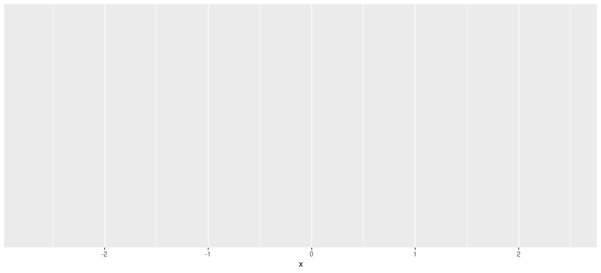<!-- -->

If you specify another column after a comma, you get a y-axis. Observe.

``` r
ggplot(Example, aes(x, y))
```

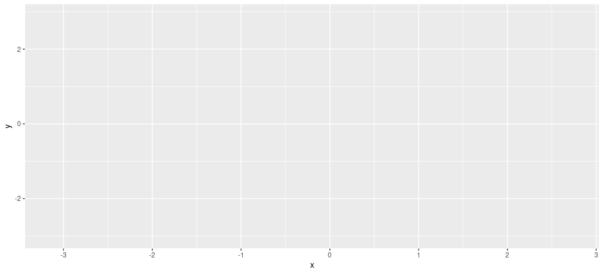<!-- -->

Notice this hasn’t plotted anything yet. It just created the canvas for
you. What comes next depends on what you want to communicate. In this
simple case, we have two variables (`x` and `y`) that are functionally
continuous and `y` is a simple linear function of `x`. This seems like
an easy call for a scatterplot. If you want to declare what type of plot
you want on your ggplot canvas, you specify it with some relevant
“geom”, preceded by a plus sign. In this case, `geom_point()` creates
dots corresponding with the coordinates of x and y. This, minimally,
creates a scatterplot. \## Scatterplot

``` r
ggplot(Example, aes(x, y)) + geom_point()
```

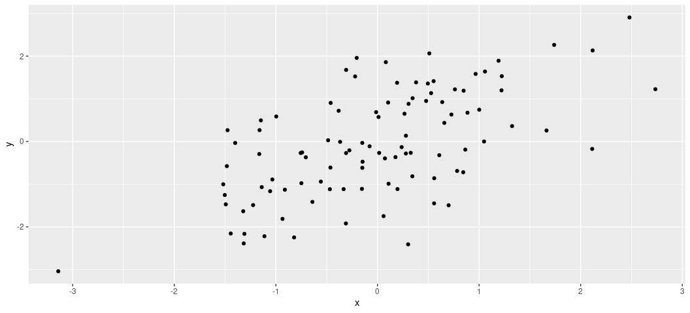<!-- -->

Notice you can stack other geoms on top of each other. For example, you
can illustrate the linear form of the data points with `geom_smooth()`.
Do note there is an optional “method” argument in `geom_smooth()`, which
I’m using to tell `{ggplot2}` that I want a linear smoother. The default
is the LOESS smoother, which is situationally useful for teasing out
non-linear relationships. If you want that default smoother, just don’t
specify the `method = 'lm'` argument.

``` r
ggplot(Example, aes(x, y)) + 
  geom_point() +
  geom_smooth() +
  geom_smooth(method = 'lm', linetype = 'dashed', color = 'black')
#> `geom_smooth()` using method = 'loess' and formula = 'y ~ x'
#> `geom_smooth()` using formula = 'y ~ x'
```

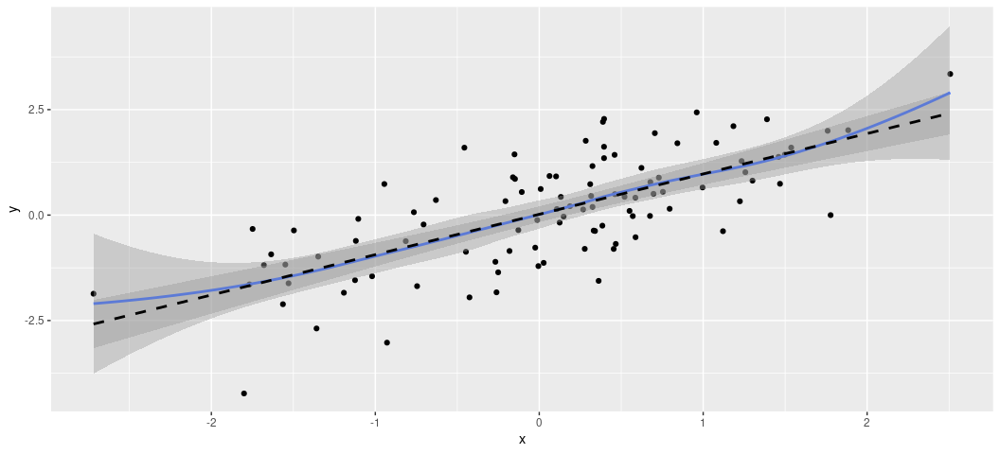<!-- -->

It’s worth saying that these plots come with all sorts of customization
options, that you’ll either want to use or not use. For example, what if
I wanted the dots to be hollow triangles? I’m not sure why in a simple
case like this that I would want that, but it’s doable.

``` r
ggplot(Example, aes(x, y)) + 
  geom_point(shape = 2) +
  geom_smooth(method = "lm")
#> `geom_smooth()` using formula = 'y ~ x'
```

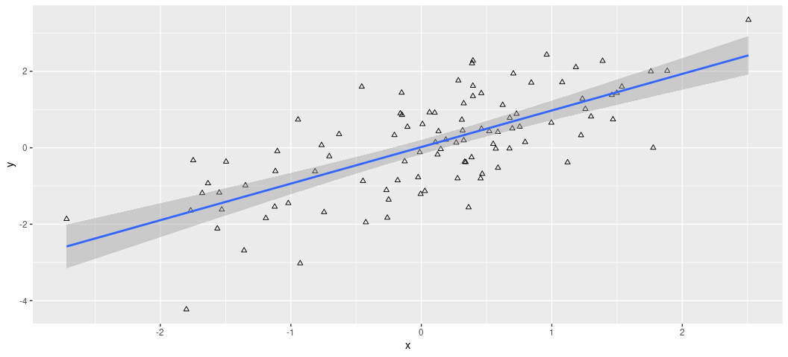<!-- -->

Feel free to explore options here. You can see them here:

- <http://www.sthda.com/english/wiki/ggplot2-point-shapes>

This would be a good time to introduce one other thing you should think
to have on all your plots: labels. As a matter of hygiene, I close all
my plots with a `labs()` argument for specifying useful information
about your plots. `labs()` takes a whole lot of arguments, some of which
are contingent on your plot’s complexity. For ease of explanation, I’m
just going to offer this code with the idea being you can see what’s
happening here.

``` r
ggplot(Example, aes(x, y)) + 
  geom_point() +
  geom_smooth(method = "lm") +
  labs(title = "The Title of My Plot",
       subtitle = "A subtitle, which may or may not be useful.",
       x = "An Informative x-Axis", y = "An Informative y-Axis",
       caption = "Data: Simulated Data. Hi Mom!")
#> `geom_smooth()` using formula = 'y ~ x'
```

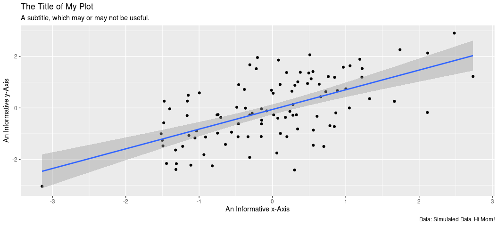<!-- -->

That’s really it. I’ll only add that if you’re preparing a graph for a
journal, you’ll want to ignore plot titles and subtitles because that
information is typically communicated as a figure caption. That’s on the
document side of things and not the plot side of things.

I’ll close with one plea here: resist the urge to roll out a default
ggplot theme and be done with it. Add a theme. What you choose is up to
you, and there is no shortage of themes out there. My preferred theme is
`theme_steve()` from my `{stevethemes}` package.

``` r
ggplot(Example, aes(x, y)) + 
  geom_point() +
  geom_smooth(method = "lm") +
  labs(title = "The Title of My Plot",
       subtitle = "A subtitle, which may or may not be useful.",
       x = "An Informative x-Axis", y = "An Informative y-Axis",
       caption = "Data: Simulated Data. Hi Mom!") +
  theme_steve(style='generic')
#> `geom_smooth()` using formula = 'y ~ x'
```

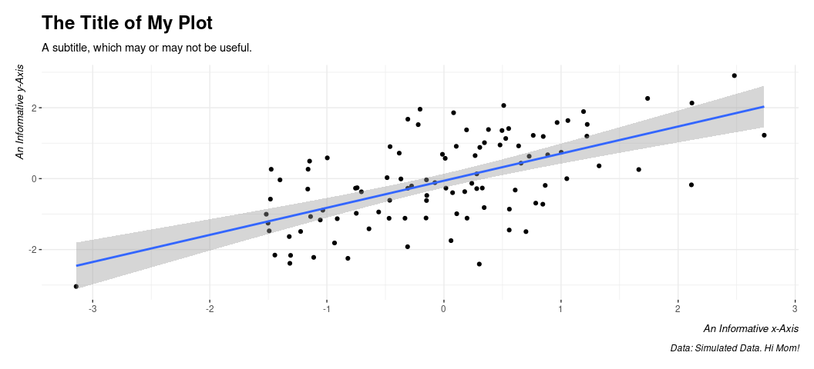<!-- -->

I want to add that you may want to explore some of the font options in
this `{stevethemes}` package. Type `?how_to_install_fonts()` for more
information. I never really think to do this, but you could use the
`theme_set()` function, preferably near the top of your script, to set a
default theme. That way, you can avoid having to manually specify a
theme each time.

``` r
theme_set(theme_steve(style='generic'))
```

Observe what this does.

``` r
ggplot(Example, aes(x, y)) + 
  geom_point() +
  geom_smooth(method = "lm")
#> `geom_smooth()` using formula = 'y ~ x'
```

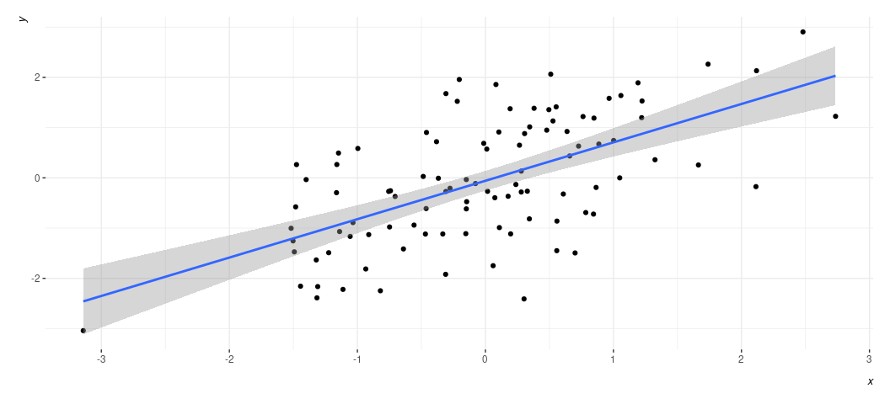<!-- -->

From here, though, everything else will be a simple matter of showing
you how to make different kinds of plots. Let’s start with what I think
to be the most basic: the bar chart. Here, the data are discrete and we
just want a rough estimate of count. Let’s use the `steves_clothes` data
frame in `{stevedata}`. This is a simple data set on the country of
origin for my dress apparel that I used for teaching undergrads in the
United States about the globalization of the garment industry. I can
show you that presentation if you like, but here let’s just note the
data set.

``` r
steves_clothes
#> # A tibble: 86 × 4
#>    type        brand      color       origin    
#>    <chr>       <chr>      <chr>       <chr>     
#>  1 dress shirt Stafford   white       Ethiopia  
#>  2 dress shirt Stafford   white       Indonesia 
#>  3 dress shirt Arrow      white plaid Bangladesh
#>  4 dress shirt Van Heusen white plaid Vietnam   
#>  5 dress shirt Uniqlo     white plaid China     
#>  6 dress shirt Van Heusen white plaid Indonesia 
#>  7 dress shirt Saddlebred white plaid Nicaragua 
#>  8 dress shirt Stafford   white plaid Vietnam   
#>  9 dress shirt Saddlebred white plaid Nicaragua 
#> 10 dress shirt Van Heusen white plaid Indonesia 
#> # ℹ 76 more rows
?steves_clothes
```

Notice that everything here is categorical. What if I wanted to get some
kind of information from this data set. For example, what is the country
of origin for most of my dress clothes? A simple bar chart will do here.
Watch what happens here:

``` r
ggplot(steves_clothes, aes(origin)) + # Don't need a y-axis. geom_bar() will give us one.
  geom_bar() +  # create a simple bar chart
  geom_text(aes(label = after_stat(count)), stat = "count", vjust = -0.5) +
  # ^ create a label/count
  theme_steve(style='generic') +
  labs(caption = "Data: ?steves_clothes in {stevedata}. Hey, that's me!",
       x = "Country of Origin", y = "Count")
```

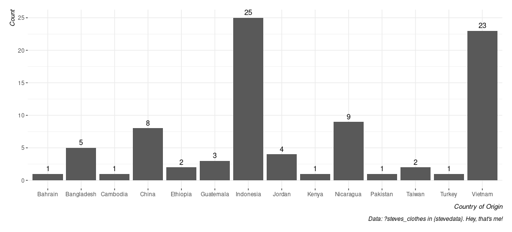<!-- -->

By default, the x-axis is ordered alphabetically. What if I wanted to
order it from highest count to lowest? Unfortunately, you will need a
few extra steps here because the only axis supplied was the origin and
the counts were done on the fly. FWIW, it’s why I typically do it this
way.

``` r
steves_clothes %>% # start with the data, and...
  summarize(n = n(), .by=origin)  %>% # get a count by origin
  arrange(-n) %>% # arrange highest to lowest
  mutate(origin = fct_inorder(origin)) %>% # make a factor with that exact order
  ggplot(.,aes(origin, n)) + # notice we now have a y-axis
  geom_bar(stat='identity', fill=g_c("su_water"), alpha=.8, color='black') +
  # ^ stat='identity' is a fancy way of saying "I calculated this for you".
  # Also: let's make this look a little cuter. alpha = .8 gives a little transparency
  # color = 'black' adds a black border and the fill argument uses the g_c() 
  # function in {stevethemes} to add Stockholm University's branded "water" color.
  geom_text(aes(label=n), vjust=-.5) + # give it a text label, and...
  theme_steve(style = 'generic') +
  labs(caption = "Data: ?steves_clothes in {stevedata}. Hey, that's me!",
       x = "Country of Origin", y = "Count")
```

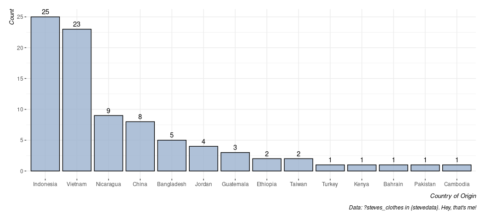<!-- -->

## Histograms and density plots

Histograms and density plots are communicating the same basic thing: the
shape of the data. The density plot is a smoothed histogram, meaning
it’s less sensitive to issues of binwidth. However, communicating
“density” on the y-axis isn’t as intuitive to the reader.

Let’s use the gss_wages data, which comes in {stevedata}. You can look
at the data here.

``` r
gss_wages
#> # A tibble: 61,697 × 11
#>     year realrinc   age occ10 occrecode   prestg10 childs wrkstat gender educcat
#>    <dbl>    <dbl> <dbl> <dbl> <chr>          <dbl>  <dbl> <chr>   <chr>  <chr>  
#>  1  1974     4935    21  5620 Office and…       25      0 School  Male   High S…
#>  2  1974    43178    41  2040 Profession…       66      3 Full-T… Male   Bachel…
#>  3  1974       NA    83    NA <NA>              NA      2 Housek… Female Less T…
#>  4  1974       NA    69    NA <NA>              NA      2 Housek… Female Less T…
#>  5  1974    18505    58  5820 Office and…       37      0 Full-T… Female High S…
#>  6  1974    22206    30   910 Business/F…       45      0 School  Male   Bachel…
#>  7  1974    55515    48   230 Business/F…       59      2 Full-T… Male   Gradua…
#>  8  1974       NA    67  6355 Constructi…       49      1 Retired Male   Less T…
#>  9  1974       NA    51  4720 Sales             28      2 Housek… Female High S…
#> 10  1974     4935    54  3940 Service           38      2 Full-T… Female Less T…
#> # ℹ 61,687 more rows
#> # ℹ 1 more variable: maritalcat <chr>
?gss_wages
```

I use these data here, which you can read about (if you’d like). -
<http://svmiller.com/blog/2020/10/inference-permutations-gender-pay-gap-general-social-survey/>

Let’s keep this exercise simple, notwithstanding how you can use these
data to explore the gender pay gap in the United States. Let’s use these
data and select on just those people who are in their so-called “peak
earning years” (which, in the U.S. context, is about 35-64) and we’ll
focus on just all observations since 2000.

``` r
gss_wages %>% 
  filter(between(age, 35, 64)) %>%
  filter(year >= 2000) -> Data
```

How might we summarize the distribution of incomes? One way is the basic
histogram, which would be this.

``` r
Data %>%
  ggplot(., aes(realrinc)) + 
  geom_histogram()
#> `stat_bin()` using `bins = 30`. Pick better value with `binwidth`.
#> Warning: Removed 4383 rows containing non-finite outside the scale range
#> (`stat_bin()`).
```

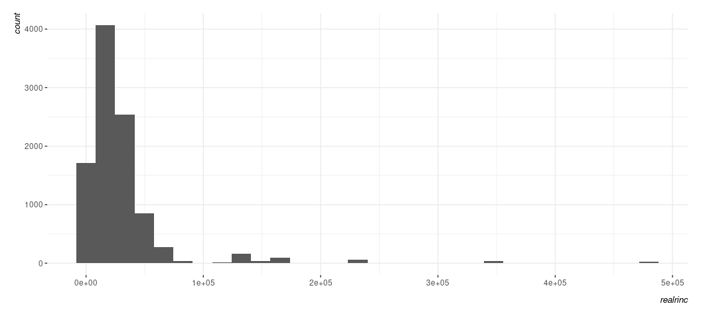<!-- -->

You can use a histogram to get a basic sense of the shape of the data,
and you basically get that here. However, there are a few things that
can be dissatisfying about the histogram. Notice the default number of
bins is 30, which is often a sensible default. You can change that by
specifying, say, bins = 60 in the geom_histogram() function if you want
to double the number of bins. Arguably a better thing to do here which
will give you a more complete sense of the shape of the data is to ask
for a density plot.

``` r
Data %>%
  ggplot(., aes(realrinc)) + 
  geom_density()
#> Warning: Removed 4383 rows containing non-finite outside the scale range
#> (`stat_density()`).
```

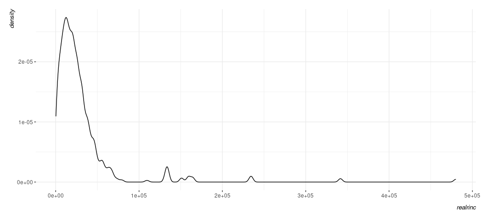<!-- -->

Because the density plot is simply a smoothed histogram, what you get to
see is not a function of how many bins you want or are given to you as a
default. That’s not to say it’s not without some issues you’ll want to
consider. For example, it too has parameters on which it depends (namely
the kernel, which typically defaults to Gaussian) and the bandwidth
(which is doing the bulk of the smoothing). {ggplot2}’s use of the
density estimate is generally fairly smart and avoids an advanced issue
you’ll at least want to be aware of (namely: the density plot may create
the appearance of data where none exist, which is something you’re more
likely to spot if you have good knowledge of what your data already look
like or what issues you could anticipate. The biggest downside of the
density plot, though, is the reader might be thrown a bit for what is
happening in the y-axis. In the histogram, it’s an intuitive count of
observations in a particular bin. In the density plot, it’s something
called a kernel density estimate following the probability density
function of the data. That sounds like it’s not a lot of fun to
communicate to the reader, and you would be forgiven for not wanting to
think too much about it. The basic takeaway then is to think about the
density plot as more for you as a diagnostic tool and to perhaps think
about the histogram more for public presentation, even if it comes with
a caveat that what exactly you see in the histogram is a function of how
many bins you ask for.

I want to close with a quick guide on adjusting the scales a bit to make
them more readable. Notice something about what you see below.

``` r
Data %>%
  ggplot(., aes(realrinc)) + 
  geom_histogram(bins = 50)
#> Warning: Removed 4383 rows containing non-finite outside the scale range
#> (`stat_bin()`).
```

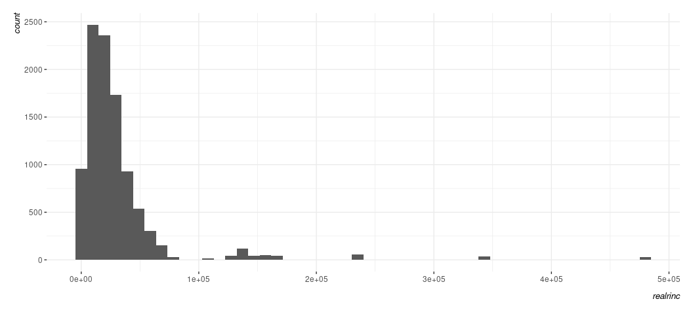<!-- -->

You know the variable in question is dollars, but R has no way of
knowing that. It just sees large nominal numbers and is representing
them in scientific notation that you don’t enjoy looking at. You can see
that the y-axis on the left has counts that can be quite large and you
may want to pretty them up a bit. How might you do that? Here’s where
you’ll want to invest time into reading about what the scale\_ functions
do in {ggplot2}. Observe:

``` r
Data %>%
  ggplot(., aes(realrinc)) + 
  geom_histogram(bins = 50) +
  scale_y_continuous(labels = scales::comma_format())
#> Warning: Removed 4383 rows containing non-finite outside the scale range
#> (`stat_bin()`).
```

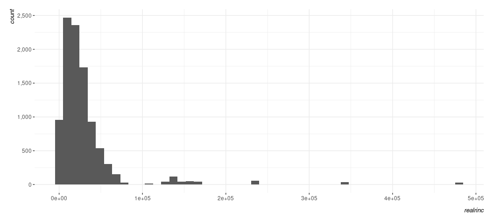<!-- -->

Here is where I’ll impress that a lot of defaults are very American.
Swedes would prefer something like this.

``` r
Data %>%
  ggplot(., aes(realrinc)) + 
  geom_histogram(bins = 50) +
  scale_y_continuous(labels = scales::comma_format(big.mark = " "))
#> Warning: Removed 4383 rows containing non-finite outside the scale range
#> (`stat_bin()`).
```

<!-- -->

You can also be crazy if you want.

``` r
Data %>%
  ggplot(., aes(realrinc)) + 
  geom_histogram(bins = 50) +
  scale_y_continuous(labels = scales::comma_format(big.mark = "åäö"))
#> Warning: Removed 4383 rows containing non-finite outside the scale range
#> (`stat_bin()`).
```

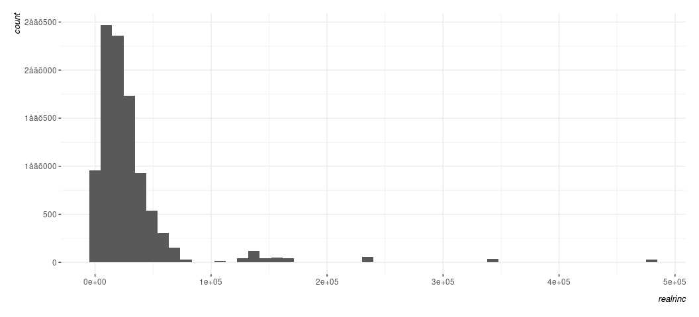<!-- -->

^ Don’t do this. I mean, you can. But don’t. Let’s adjust the scale on
the x-axis to add labels that communicate dollars.

``` r
Data %>%
  ggplot(., aes(realrinc)) + 
  geom_histogram(bins = 50) +
  scale_y_continuous(labels = scales::comma_format()) +
  scale_x_continuous(labels = scales::dollar_format())
#> Warning: Removed 4383 rows containing non-finite outside the scale range
#> (`stat_bin()`).
```

<!-- -->

Note that there might be some trial and error you want to experiment
with here, much of which is dependent on what you know about the data.
For example, R just sees large nominal numbers and is adjusting defaults
accordingly. However, I know that dollar increments of income in
hundreds of thousands is awfully large. I can adjust the scale on x to
add more ticks for 50k increments like this, if I so chose.

``` r
Data %>%
  ggplot(., aes(realrinc)) + 
  geom_histogram(bins = 50) +
  scale_y_continuous(labels = scales::comma_format()) +
  scale_x_continuous(labels = scales::dollar_format(),
                     breaks = seq(0, 500000, by=50000))
#> Warning: Removed 4383 rows containing non-finite outside the scale range
#> (`stat_bin()`).
```

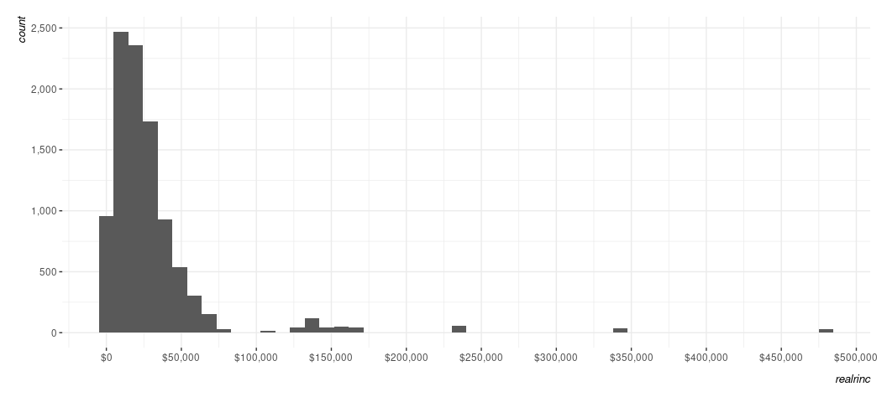<!-- -->

## A comment on saving what you do.

There are somewhat advanced techniques I would love to teach you here,
but I think I’ve tabled much of it until the final computer lab. No
matter, let’s talk about saving what you do. First, let’s create a
legible version of the plot above, but with some additional aesthetic
stuff that I hope is clear/intuitive without me having to belabor it for
the sake of this point.

``` r
Data %>%
  ggplot(., aes(realrinc)) + 
  # I'll leave it to you to play with what's happening here.
  geom_histogram(bins = 50,
                 alpha = 0.8,
                 color = 'black',
                 fill = "#619cff") +
  scale_y_continuous(labels = scales::comma_format()) +
  scale_x_continuous(labels = scales::dollar_format(),
                     breaks = seq(0, 500000, by=50000)) +
  labs(caption = "Data: General Social Survey (2000-2018)",
       y = "Number of Observations in Bin",
       x = "Respondent's Base Income (in 1986 USD)")
#> Warning: Removed 4383 rows containing non-finite outside the scale range
#> (`stat_bin()`).
```

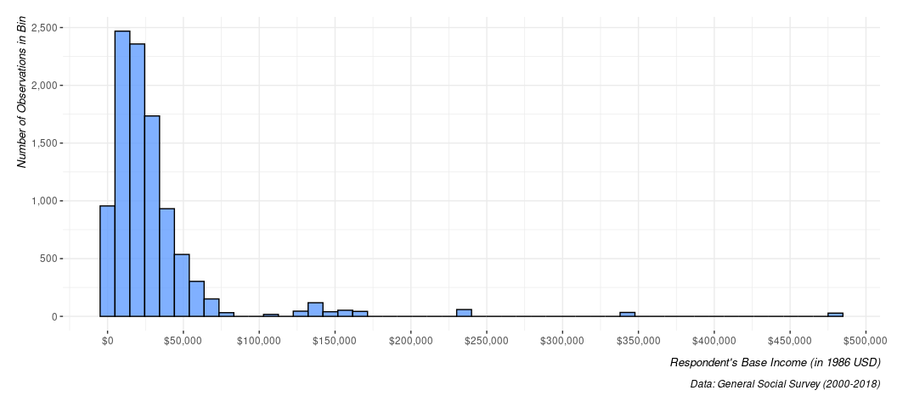<!-- -->

Notice your plot? See the “Export” tab there? Click it and go with “Save
image”, probably because you are not exporting to LaTeX and your Word
document wouldn’t really want PDF graphics. Save what you see as a .png
file wherever it is you want. Note you can adjust the dimensions of the
plot here, though you should be kinda careful (or experimental) with
what you do here. If you adjust the dimensions, it is *probably*
advisable that you maintain the aspect ratio. You can do whatever you
want with what you just did, though you may be wanting to drag it into a
Word document. It’s as simple as, well, dragging it into a Word
document.

Now, here’s the fun part that you should also be mindful to do. Remember
the `Data` object we created?

``` r
Data
#> # A tibble: 14,292 × 11
#>     year realrinc   age occ10 occrecode   prestg10 childs wrkstat gender educcat
#>    <dbl>    <dbl> <dbl> <dbl> <chr>          <dbl>  <dbl> <chr>   <chr>  <chr>  
#>  1  2000     5985    48  5700 Office and…       47      2 Full-T… Female High S…
#>  2  2000       NA    39  3250 Profession…       68      1 Full-T… Female High S…
#>  3  2000    18287    36  4965 Sales             31      0 Full-T… Male   High S…
#>  4  2000     4987    44    40 Business/F…       57      2 Full-T… Female Junior…
#>  5  2000    36575    44  5000 Office and…       46      1 Full-T… Male   Gradua…
#>  6  2000    44887    47   800 Business/F…       60      3 Full-T… Male   Bachel…
#>  7  2000    44887    53   230 Business/F…       59      1 Full-T… Female Gradua…
#>  8  2000    66500    52  1006 Profession…       65      1 Full-T… Male   Gradua…
#>  9  2000    18287    52  4220 Service           24      1 Full-T… Male   High S…
#> 10  2000    36575    51   800 Business/F…       60      0 Full-T… Male   Bachel…
#> # ℹ 14,282 more rows
#> # ℹ 1 more variable: maritalcat <chr>
```

Let’s save it now. The exact format to which you want to save it is to
your discretion. If your data set is super small, then a .csv or a .tsv
file is sufficient. You can open those in Excel and look at it to no
real problem. However, the data we have here have more than 14,000 rows
so that’s not a productive thing to do. You could do it, but let’s
explore our options.

So, let’s save it as an R serialized data frame. First, let’s see where
our working directory is. It’s important to note you and I are assuredly
going to have different working directories here.

``` r
getwd()
#> [1] "/home/steve/Koofr/teaching/eh1903-ir3/2/scripts"

saveRDS(Data, "my-toy-data-set.rds")
```

Let’s experiment with alternatives now.

``` r
haven::write_dta(Data, "my-toy-data-set.dta")
write_csv(Data, "my-toy-data-set.csv", na = '') # note, if you have NAs, do this.

# That's about it.
```
