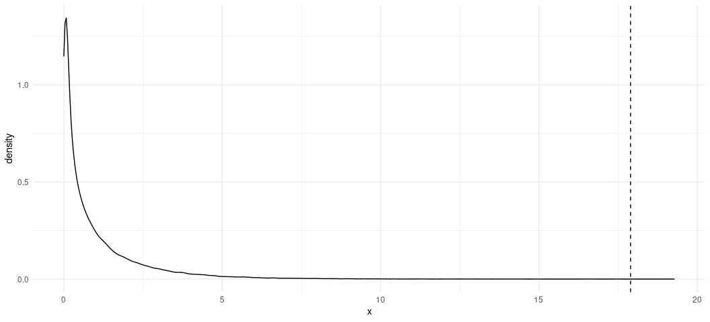

``` r

#
#
#　　　　　　　　　　　　　　　l^丶
#　 　Testing             | 　'゛''"'''゛ y-―,
#　　　Proportions　　　　 ミ　´ ∀ ｀　　,:'
#　　　and　 　　　　　　　(丶　　　　(丶 ミ
#　　　Means　　　 （（　 　 ミ　　　　　　　 ;':　ハ,_,ハ
#　　　　　　　　　　　　　　;:　　　　　　 　ミ 　';´∀｀';,　 
#　　　　　　　　　　　　　　`:; 　　　　　　,:'　ｃ　 ｃ.ミ
#　　　　　　　　　　　　　　　U"゛'''~"＾'丶)　　　u''゛"J
```

## If it’s not installed, install it.

``` r
library(tidyverse)
#> ── Attaching core tidyverse packages ──────────────────────── tidyverse 2.0.0 ──
#> ✔ dplyr     1.1.4     ✔ readr     2.1.4
#> ✔ forcats   1.0.0     ✔ stringr   1.5.0
#> ✔ ggplot2   3.5.1     ✔ tibble    3.3.0
#> ✔ lubridate 1.9.4     ✔ tidyr     1.3.0
#> ✔ purrr     1.1.0     
#> ── Conflicts ────────────────────────────────────────── tidyverse_conflicts() ──
#> ✖ dplyr::filter() masks stats::filter()
#> ✖ dplyr::lag()    masks stats::lag()
#> ℹ Use the conflicted package (<http://conflicted.r-lib.org/>) to force all conflicts to become errors
library(stevedata)
```

Reminder: Please have read this:

- <https://svmiller.com/blog/2025/08/simple-tests-for-arms-races-war/>

It takes a lot of time to write things out for the sake of new material.
What follows here is just a reduced form of what I make available on my
blog.

## Load and prepare the data

The data I’ll be using for the bulk of this lab script is the `mmb_war`
data that I describe in the blog post above. You should have this in
`{stevedata}`, and I may or may not make a copy of it available on
Athena. Here’s how I’ll be loading it into the data for the sake of this
presentation.

``` r
Data <- stevedata::mmb_war

Data
#> # A tibble: 2,324 × 9
#>    ccode1 ccode2 tssr_id micnum  year dyfatmin dyfatmax sumevents   mmb
#>     <dbl>  <dbl>   <int>  <dbl> <dbl>    <dbl>    <dbl>     <dbl> <dbl>
#>  1      2     40     130    246  1960        0        0        20     0
#>  2      2     40     130     61  1962        0        0        35     0
#>  3      2     40     130   2225  1979        0        0         2     0
#>  4      2     40     130   2972  1981        0        0         4     0
#>  5      2     40     130   2981  1983        0        0         1     0
#>  6      2     40     130   3058  1983        4       25         2     0
#>  7      2     40     130   2742  1986        0        0         2     0
#>  8      2     70      32   1554  1836        0        0         5     0
#>  9      2     70      32   1553  1838        0        0         4     0
#> 10      2     70      32   1556  1839        0        0         2     0
#> # ℹ 2,314 more rows
```

As I noted in the blog post accompanying this particular session, the
only that’s missing from the data is a binary measure of war we need to
create. The industry standard in quantitative peace science is
operationalizing war from any confrontation where fatalities exceed
1,000. We’ll be doing that with the minimum dyadic fatalities observed
in the confrontation. That’s the `dyfatmin` column here.

``` r
Data %>%
  mutate(war = ifelse(dyfatmin >= 1000, 1, 0)) -> Data

Data
#> # A tibble: 2,324 × 10
#>    ccode1 ccode2 tssr_id micnum  year dyfatmin dyfatmax sumevents   mmb   war
#>     <dbl>  <dbl>   <int>  <dbl> <dbl>    <dbl>    <dbl>     <dbl> <dbl> <dbl>
#>  1      2     40     130    246  1960        0        0        20     0     0
#>  2      2     40     130     61  1962        0        0        35     0     0
#>  3      2     40     130   2225  1979        0        0         2     0     0
#>  4      2     40     130   2972  1981        0        0         4     0     0
#>  5      2     40     130   2981  1983        0        0         1     0     0
#>  6      2     40     130   3058  1983        4       25         2     0     0
#>  7      2     40     130   2742  1986        0        0         2     0     0
#>  8      2     70      32   1554  1836        0        0         5     0     0
#>  9      2     70      32   1553  1838        0        0         4     0     0
#> 10      2     70      32   1556  1839        0        0         2     0     0
#> # ℹ 2,314 more rows
```

Now we’re ready to go. We already have our primary arms race variable
(`mmb`).

There are a few ways in which you can do this. For example, the
`table()` function is a base R that will create a cross-tabulation for
you without a whole lot of effort. Just supply it the two vectors you
want, like this.

``` r
table(Data$war, Data$mmb)
#>    
#>        0    1
#>   0 2049   75
#>   1  180   20
```

When you do it this way, the first argument (`Data$war`) is a column
that becomes the information in the rows whereas the second argument
(`Data$mmb`) is the information that becomes the columns. Here’s how
you’d read this table with that in mind.

- **Top-left (a):** There were 2,049 confrontations that *did not*
  become wars (i.e. `war = 0`) and for which there was no mutual
  military build-up preceding the confrontation (`mmb = 0`).
- **Top-right (b):** There were 75 confrontations that *did not* become
  wars (i.e. `war = 0`) but there was a mutual military build-up
  preceding it (`mmb = 1`).
- **Bottom-left (c):** There were 180 confrontations that became wars
  (i.e. `war = 1`), but did not have a mutual military build-up
  preceding it (`mmb = 0`).
- **Bottom-right (d):** There were 20 confrontations that became wars
  (i.e. `war = 1`), and did have a mutual military build-up preceding it
  (`mmb = 1`).

I mention this here because I think it’s important, if not critical.
Chi-square tests do not care about what is the row and what is the
column because it’s primarily multiplying row and column totals
together. However, there is a (reasonable) convention in the social
science world that anything you understand to be a “cause” is a column
in a cross-tab. In our case, we 100% understand that arms races are
potentially causes of confrontation escalation to war and not
necessarily the other way around (given how we operationalize them). You
are not obligated to hold to that convention, but I would encourage it.

You could also see for yourself with some slightly more convoluted code.

``` r
Data %>% 
  # This just splits the data by each unique combination of war and MMB
  # It wouldn't be elegant if you had missing data
  split(., paste("War = ", .$war, "; MMB = ", .$mmb, sep = "")) %>%
  # map() summarizes each data frame in the list
  map(~summarize(., n = n())) %>%
  # bind_rows() flattens this list into a data frame, with a new id column,
  # called `war_mmb` communicating each unique combination of mmb and war
  bind_rows(, .id = "war_mmb")
#> # A tibble: 4 × 2
#>   war_mmb              n
#>   <chr>            <int>
#> 1 War = 0; MMB = 0  2049
#> 2 War = 0; MMB = 1    75
#> 3 War = 1; MMB = 0   180
#> 4 War = 1; MMB = 1    20
```

If you do it this way (i.e. by manually getting counts to create your
own contingency table), I strongly encourage making a matrix of this
information. You just have to be careful how you construct it. Let’s
first create a vector of the counts, like this:

``` r
v <- c(2049, 75, 180, 20)
v
#> [1] 2049   75  180   20
```

Let’s wrap it in a `matrix()` function now.

``` r
matrix(v)
#>      [,1]
#> [1,] 2049
#> [2,]   75
#> [3,]  180
#> [4,]   20
```

Oops, that’s not what we want. We want a 2x2 matrix. For a simple 2x2
matrix, we just need to specify that `nrow = 2` (or `ncol = 2`). Be
mindful of the dimensions of your intended matrix.

``` r
matrix(v, nrow = 2)
#>      [,1] [,2]
#> [1,] 2049  180
#> [2,]   75   20
```

Oops, that’s also not what we want. By default, `matrix()` fills column
down. We wanted that 75 to be in the `b` position (top-right), but it
went in the `c` position (bottom-left). If this happens to you when
you’re manually creating your matrix, just toggle `byrow = TRUE`. It’s
`FALSE` as a hidden default.

``` r
matrix(v, nrow = 2, byrow = TRUE)
#>      [,1] [,2]
#> [1,] 2049   75
#> [2,]  180   20
```

Now that we’re happy with what we got, we assign to an object to use
later.

``` r
mat <- matrix(v, nrow = 2, byrow = TRUE)
mat
#>      [,1] [,2]
#> [1,] 2049   75
#> [2,]  180   20
```

The chi-squared test itself is a really simple test with a very
straightforward interpretation. Its test statistic is referenced to a
chi-squared distribution that checks for consistency with a chi-squared
distribution with some degree of freedom determined by the product of
the number of rows and columns (each subtracted by 1 prior to
multiplication). The sum of deviations from what’s expected produces a
chi-squared value that, if it’s sufficiently large or outside what’s
expected from a “normal” chi-squared distribution, produces a *p*-value
that allows you to reject the null hypothesis of random differences
between observed values and expected values.

That’s basically what you see here, however you specify this chi-squared
test.

``` r
chisq.test(table(Data$war, Data$mmb))
#> 
#>  Pearson's Chi-squared test with Yates' continuity correction
#> 
#> data:  table(Data$war, Data$mmb)
#> X-squared = 17.895, df = 1, p-value = 2.335e-05
chisq.test(mat)
#> 
#>  Pearson's Chi-squared test with Yates' continuity correction
#> 
#> data:  mat
#> X-squared = 17.895, df = 1, p-value = 2.335e-05
```

Simulation is useful for illustrating what the chi-squared statistic is
illustrating with respect to its eponymous distribution. We have a
distribution with one degree of freedom, representing a singular
standard normal variate to square. It’s conceivable, however rare, that
you could draw a singular 4 from that distribution to square. You’d
expect about 95% of the distribution under those circumstances to be
around 1.96^2 or thereabouts (about 3.84). Intuitively, if the
differences we observe were random fluctuations, they’d be consistent
with a chi-squared distribution with that singular degree of freedom.
Anything outside those bounds and we’re left with the impression the
differences we observe are not just random squared differences.

Again, simulation is nice for this. Let’s simulate 100,000 random
numbers from a chi-square distribution with a singular degree of freedom
parameter.

``` r
set.seed(8675309)
tibble(x = rchisq(100000, 1)) -> chisqsim

chisqsim
#> # A tibble: 100,000 × 1
#>         x
#>     <dbl>
#>  1 0.0713
#>  2 0.202 
#>  3 5.98  
#>  4 2.16  
#>  5 0.732 
#>  6 0.0103
#>  7 0.182 
#>  8 0.0717
#>  9 5.71  
#> 10 0.304 
#> # ℹ 99,990 more rows
```

FYI: this will have a mean that approximates 1 (the degree of freedom
parameter).

``` r
mean(chisqsim$x)
#> [1] 1.00119
```

Tell me if you recognize these numbers…

``` r
quantile(chisqsim$x, .90)
#>      90% 
#> 2.706441
quantile(chisqsim$x, .95)
#>      95% 
#> 3.833134
```

Let’s plot this distribution now, and assign a vertical line
corresponding with our test statistic.

``` r
ggplot(chisqsim, aes(x)) +
  geom_density() +
  theme_minimal() +
  geom_vline(xintercept = 17.895, linetype = 'dashed')
```

<!-- -->

Our test statistic is almost an impossibility in the chi-squared
distribution.

``` r
chisqsim %>% filter(x >= 17.895)
#> # A tibble: 3 × 1
#>       x
#>   <dbl>
#> 1  18.9
#> 2  19.3
#> 3  18.4
```

Indeed, we only observed it three times in 100,000 simulations of this
distribution.

## Choose Your Own Adventure with the *t*-test

I have three articles on the course description for which you need to do
an article summary. I also have three data sets in `{stevedata}` that
are either the data sets themselves or allow for reasonable
approximations of what the authors are doing.

``` r
EBJ        # reduced form of Appell and Loyle (2012)
#> # A tibble: 95 × 12
#>    testnewid_lag ccode    id     fdi   pcj econ_devel    econ_size econ_growth
#>            <dbl> <dbl> <dbl>   <dbl> <dbl>      <dbl>        <dbl>       <dbl>
#>  1       2880000    41    71   -9.80     0      1182.   8407079981      -2.13 
#>  2       2882880    41    71    6.60     0      1089.   8055393763     -14.9  
#>  3       2850000    52   154  510.       0      7743.   9542938026       1.94 
#>  4       3080000    70   102 -341.       0      6895. 628418000000      -7.86 
#>  5       3083080    70   102 6461.       0      7780. 730752000000       5.23 
#>  6       1361360    90    67  431.       1      3062.  31339424077       0.628
#>  7       2200000    92   141   -7        0      2093.   9756946007       2.28 
#>  8       2202200    92   141  264.       1      3045.  16729584566       5.89 
#>  9       2400000    93   116    2.70     0      1302.   4239808540       1.64 
#> 10       2402400    93   116  337.       1      1350.   5588425124      -2.31 
#> # ℹ 85 more rows
#> # ℹ 4 more variables: kaopen <dbl>, xr <dbl>, lf <dbl>, lifeexp <dbl>
PRDEG      # full replication of Leblang (1996)
#> # A tibble: 147 × 10
#>    levine country   decade private  rgdp democ   pri   sec  grow xcontrol
#>     <dbl> <chr>      <dbl>   <dbl> <dbl> <dbl> <dbl> <dbl> <dbl>    <dbl>
#>  1      4 Argentina      1  0.0797  3.09     3  19.9  5.19  2.77    0.5  
#>  2      4 Argentina      2  0.166   4.00     1  30.6  7.5   1.38    0.545
#>  3      4 Argentina      3  0.128   4.34     1  33    9.17 -2.35    0.800
#>  4      5 Australia      1  0.218   5.18    10  20.0 25.6   3.11    0.5  
#>  5      5 Australia      2  0.259   7.34    10  16.2 20.9   1.79    0    
#>  6      5 Australia      3  0.351   8.35    10  15.9 21.4   1.73    0    
#>  7      6 Austria        1  0.425   3.91    10  50.3  1.99  3.74    1    
#>  8      6 Austria        2  0.539   5.84    10  33.2 15.5   3.78    0.273
#>  9      6 Austria        3  0.682   8.23    10  32.4 16.5   1.90    0    
#> 10      9 Belgium        1  0.135   4.38    10  37.0 11.7   4.26    0.350
#> # ℹ 137 more rows
states_war # approximation of Valentino et al. (2010)
#> # A tibble: 284 × 23
#>    micnum ccode stdate enddate mindur maxdur sidea  orig hiact fatalmin fatalmax
#>     <dbl> <dbl> <chr>  <chr>    <dbl>  <dbl> <dbl> <dbl> <dbl>    <dbl>    <dbl>
#>  1      8   630 7/11/… 3/26/1…    259    259     0     1    22     1000     1400
#>  2      8   200 7/11/… 3/26/1…    259    259     1     1    22       27       75
#>  3     19   337 4/10/… 8/9/18…    122    122     1     0    22       14       80
#>  4     19   332 4/10/… 8/9/18…    122    122     1     0    22       14       80
#>  5     19   325 3/1/1… 8/9/18…    527    527     1     1    22     3545     4355
#>  6     19   300 3/1/1… 8/9/18…    527    527     0     1    22     2570     3522
#>  7     19   329 3/-9/… 8/9/18…    132    162     1     0    22       80      200
#>  8     19   327 3/-9/… 6/11/1…     73    103     1     0    22      390      485
#>  9     31   300 5/30/… 2/10/1…    257    257     1     1    22        1       10
#> 10     31   325 5/30/… 2/10/1…    257    257     1     1    22        1       10
#> # ℹ 274 more rows
#> # ℹ 12 more variables: oppfatalmin <dbl>, oppfatalmax <dbl>, milex <dbl>,
#> #   milper <dbl>, cinc <dbl>, tpop <dbl>, v2x_polyarchy <dbl>, polity2 <dbl>,
#> #   xm_qudsest <dbl>, wbgdp2011est <dbl>, wbpopest <dbl>, wbgdppc2011est <dbl>
```

Taking requests for something more interactive for illustrating a
t-test.
