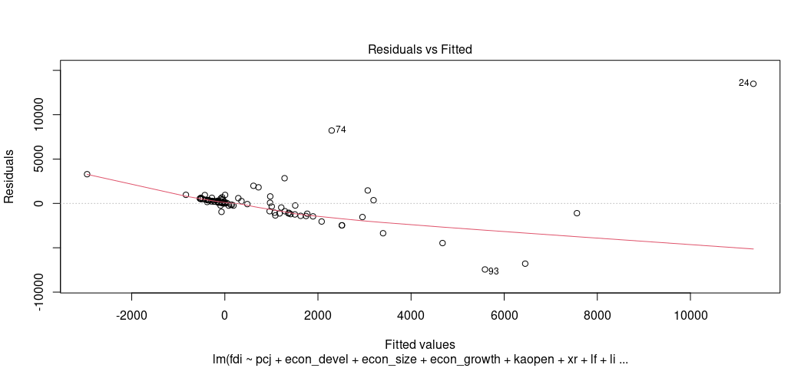
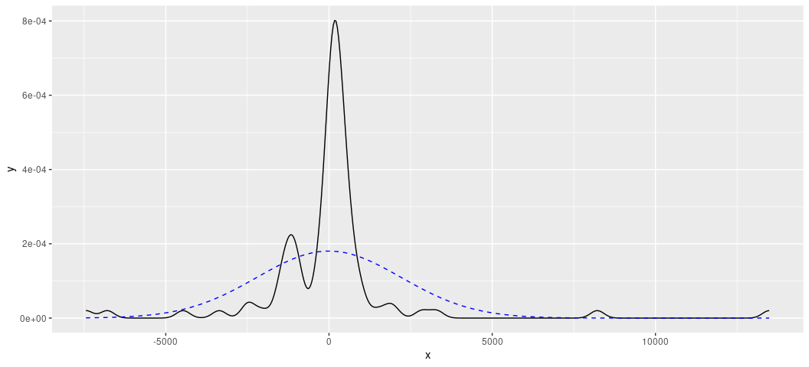

``` r
#
#   |\      _,,,---,,_
#   /,`.-'`'    -.  ;-;;,_
#  |,4-  ) )-,_..;\ (  `'-'
# '---''(_/--'  `-'\_)   Linear Models
#
```

## If it’s not installed, install it.

``` r
library(tidyverse)
#> ── Attaching core tidyverse packages ──────────────────────── tidyverse 2.0.0 ──
#> ✔ dplyr     1.1.4     ✔ readr     2.1.4
#> ✔ forcats   1.0.0     ✔ stringr   1.5.0
#> ✔ ggplot2   4.0.0     ✔ tibble    3.3.0
#> ✔ lubridate 1.9.4     ✔ tidyr     1.3.0
#> ✔ purrr     1.1.0     
#> ── Conflicts ────────────────────────────────────────── tidyverse_conflicts() ──
#> ✖ dplyr::filter() masks stats::filter()
#> ✖ dplyr::lag()    masks stats::lag()
#> ℹ Use the conflicted package (<http://conflicted.r-lib.org/>) to force all conflicts to become errors
library(stevemisc)
#> 
#> Attaching package: 'stevemisc'
#> 
#> The following object is masked from 'package:lubridate':
#> 
#>     dst
#> 
#> The following object is masked from 'package:dplyr':
#> 
#>     tbl_df
library(stevethemes) # Optional; gonna use it anyway

theme_set(theme_steve(style = 'generic'))
```

## Load the data

This code will work for me and it will assume you’ve downloaded the
`.dta` file in question and put it somewhere on your hard drive. Do you
see that `haven::read_dta()` function? Put the location to the
`appelloyle_jprdata.dta` file there.

To make this simpler, we’re going to use `mutate()` as a glorified
`rename()` to create more intuitive variable names and select just what
we want for this simple exercise. However, successful execution of this
command requires you correctly specifying the location of the `.dta`
file you downloaded from Athena.

``` r
haven::read_dta("http://svmiller.com/extdata/appelloyle_jprdata.dta") %>%
  mutate(fdi = v3Mdiff,
         pcj = truthvictim,
         econ_devel = fv8,
         econ_size = fv10,
         econ_growth = fv11,
         kaopen = fv34,
         xr = xratf,
         lf = labor,
         lifeexp = v64mean) %>%
  select(testnewid_lag, ccode, id, fdi:lifeexp) -> Data

# Alternatively, for convenience
Data <- stevedata::EBJ
# Let's look at the contents.

Data
#> # A tibble: 95 × 12
#>    testnewid_lag ccode    id     fdi   pcj econ_devel    econ_size econ_growth
#>            <dbl> <dbl> <dbl>   <dbl> <dbl>      <dbl>        <dbl>       <dbl>
#>  1       2880000    41    71   -9.80     0      1182.   8407079981      -2.13 
#>  2       2882880    41    71    6.60     0      1089.   8055393763     -14.9  
#>  3       2850000    52   154  510.       0      7743.   9542938026       1.94 
#>  4       3080000    70   102 -341.       0      6895. 628418000000      -7.86 
#>  5       3083080    70   102 6461.       0      7780. 730752000000       5.23 
#>  6       1361360    90    67  431.       1      3062.  31339424077       0.628
#>  7       2200000    92   141   -7        0      2093.   9756946007       2.28 
#>  8       2202200    92   141  264.       1      3045.  16729584566       5.89 
#>  9       2400000    93   116    2.70     0      1302.   4239808540       1.64 
#> 10       2402400    93   116  337.       1      1350.   5588425124      -2.31 
#> # ℹ 85 more rows
#> # ℹ 4 more variables: kaopen <dbl>, xr <dbl>, lf <dbl>, lifeexp <dbl>
```

Incidentally, if you’d like, you can watch me go HAM on this exact data
here:

- <http://svmiller.com/blog/2024/01/linear-model-diagnostics-by-ir-example/>

## Appel and Loyle (2012)

We’re going to offer a basic replication of Appel and Loyle (2012). Some
of you read this for your article summary and are aware of its contents.
Briefly: the authors are trying to explain variation in FDI inflows as a
function of whether a post-conflict state engaged in post-conflict
justice. You may(?) remember some of these things from IRI where you
may(?) have read about things like truth commissions and transitional
justice. In this application, the authors are measuring whether a
post-conflict state engaged in post-conflict justice by whether a
post-conflict state set up a truth commission and/or reparation
programs. There is a theoretical argument for why we should expect to
see a positive relationship that they outline and you should know it.
The logic isn’t too hard to follow, though it assumes some comfort with
thinking economically, politically, and strategically.

### A simple bivariate model

Expressed in regression terms, the authors want to know what is the
effect of post-conflict justice (0 or 1) on net FDI inflows over a
10-year post-conflict period. They want an estimate of that effect and
whether we can discern a signal from the noise. IF you wanted to do this
yourself in R, it’d be something like this.

``` r
M1 <- lm(fdi ~ pcj, data = Data)
summary(M1)
#> 
#> Call:
#> lm(formula = fdi ~ pcj, data = Data)
#> 
#> Residuals:
#>     Min      1Q  Median      3Q     Max 
#> -4047.4  -459.1  -418.7  -136.9 22648.3 
#> 
#> Coefficients:
#>             Estimate Std. Error t value Pr(>|t|)  
#> (Intercept)    425.0      323.9   1.312   0.1927  
#> pcj           1763.5      744.0   2.370   0.0198 *
#> ---
#> Signif. codes:  0 '***' 0.001 '**' 0.01 '*' 0.05 '.' 0.1 ' ' 1
#> 
#> Residual standard error: 2842 on 93 degrees of freedom
#> Multiple R-squared:  0.05696,    Adjusted R-squared:  0.04682 
#> F-statistic: 5.618 on 1 and 93 DF,  p-value: 0.01985
```

When you get this, you’re getting a lot of stuff to look at. I’ll go by
order of practical importance.

The star of the show here is the effect of post-conflict justice. See
the coefficient is 1763.5 (a large nominal number to be sure). Absent
any more information, it suggests that the difference in net FDI inflows
over a 10-year period for post-conflict states that engage in PCJ versus
those that don’t is a difference of \$1,763.5. PCJ states have higher
FDI inflows, consistent with the authors’ argument. However, there’s
always the lingering chance that a world surrounded by noise resulted in
a positive coefficient when the actual “true” effect could be 0. Notice
we have a standard error with that estimate, which is 744.0. The process
that follows is not too dissimilar to creating *z*-scores. Take the
estimate and divide it over the standard error, and you get that
*t*-value you see of 2.370. Because this is a t-distribution (with 93
degrees of freedom), the process isn’t as simple as inference by the
normal distribution. Here, let the fourth column (“Pr(\>\|t\|)”) guide
you. That is communicating a probability of observing the (positive)
effect we observed if the true differences between groups with and
without post-conflict justice is 0. Here’s what this is telling you: if
the God’s-honest-truth was that there was no difference in net FDI
inflows for these two categories of states, the probability of us
observing what we observed, assuming infinity trials, is .0198. That’s
so kind of rare that we’re inclined to argue that the effect we observed
is closer to what the truth is. It’s not 0; it’s positive, and the
estimate of \$1763.5 may not be “correct” but it’s closer to the truth
than 0.

Oh, btw, if you want to calculate that p-value yourself, here it is.

``` r
pt(2.37, df=93, lower.tail = F)*2
#> [1] 0.01985368
```

^ let R’s default summary() method do it for you.

Because this is a simple bivariate linear model where the IV is
incidentally binary, there is a nice interpretation of the intercept.
The estimated net FDI inflow for states without PCJ institutions is
\$425. The estimated net FDI inflow for states with PCJ institutions is
\$425 + \$1763.5. Notice the intercept communicates the estimate of *y*
when everything on the right-hand side of the equation is 0. The fact
that it has no “stars” doesn’t tell you it’s not “significant” or
whatever because there is no hypothesis attached to the intercept.
You’re not evaluating an argument in the intercept, really. However, one
interesting wrinkle from this that is germane to the author’s argument
is that a simple comparison of groups with PCJ institutions and without
PCJ institutions suggests the non-PCJ states may, on average, not be
taking in any FDI at all.

I don’t want to say this is necessarily the next “most important” thing,
but it’s probably the next place to go for beginners. Let’s talk
R-square, both of them actually. R-square is a so-called “goodness of
fit” statistic because it tells you how well (‘good’) the model you
estimated “fits” the data. The “multiple” R-square is the overall fit
whereas the adjusted flavor carries a small “penalty” of a kind that
decreases with every parameter added to the model. While multiple
R-square can never be negative (i.e. you’re always explaining at least a
little variation), the adjusted R-square might be negative for models
with lots of noise parameters. In this simple case, notice two
things: 1) The R-square is about .05, suggesting only about 5% of the
variation in net FDI inflows is accounted for by this PCJ indicator. The
adjusted R-square is slightly smaller than the multiple R-square because
you  
actually have two parameters here and not one. You have the one
coefficient, but the intercept is a parameter too.

You may have learned this in lecture, but the multiple R-square in the
simple bivariate linear model has a nice property. It’s literally
Pearson’s *r*, squared. Observe.

``` r
cor(Data$fdi, Data$pcj)
#> [1] 0.2386717
cor(Data$fdi, Data$pcj)^2
#> [1] 0.05696419
broom::glance(M1)[1] %>% pull()
#> [1] 0.05696419
```

The addition of other parameters breaks this property and the multiple
R-square is instead derived from knowing the residuals and the deviance
of the model, which is a conversation for the MA students and not you.

A few other things before closing up:

1)  R’s default summary output gives you a summary of the residuals,
    which is kind of wonky. By definition, the mean of the residuals
    is 0. Ideally, you want the median around there too. Also ideally: a
    simple linear model with a bivariate IV is kind of borrowing
    trouble, especially if we haven’t looked carefully at our DV.
2)  It’s uncomfortable that a lot of our beginner language says “don’t
    forget the F-test”, but all the homies hate the F-test. The F-test
    tests against a null hypothesis that the model you estimate performs
    just as well as one that is guessing just the mean of the DV. The
    moment you start to know anything about your data-generating process
    is the moment you can ignore this statistic. It really is
    beginner-level stuff from like 100 years ago.
3)  The residual standard error is an estimate derived from the model
    about the variability of the residuals and how they differ from the
    line. “Higher” values indicate more variability, but also may say
    something about the data. The model here are nominal dollars, so
    take that into consideration.

### A Replication of Model 1 in Table 1

Let’s replicate Model 1 in Table 1. We started with a simple bivariate
model, but we need to add “relevant controls” that could be influencing
the relationship between PCJ and FDI. After all, is FDI not an economic
matter? It tracks that, for example, capital openness will influence FDI
inflows. Post-conflict states are probably poor and without a lot of
capital openness. The same can be said for the other indicators in
Model 1. How do we “control” for this in the linear model in R? Simple:
Add them to the right-hand side of the equation, separated by a + sign.
Observe:

``` r
M2 <- lm(fdi ~ pcj + econ_devel + econ_size + econ_growth +
           kaopen + xr +  lf+ lifeexp,
         data = Data)

summary(M2)
#> 
#> Call:
#> lm(formula = fdi ~ pcj + econ_devel + econ_size + econ_growth + 
#>     kaopen + xr + lf + lifeexp, data = Data)
#> 
#> Residuals:
#>     Min      1Q  Median      3Q     Max 
#> -7445.9  -402.1   123.2   369.1 13484.6 
#> 
#> Coefficients:
#>               Estimate Std. Error t value Pr(>|t|)    
#> (Intercept) -2.012e+03  2.678e+03  -0.751 0.454575    
#> pcj          1.533e+03  6.294e+02   2.435 0.016957 *  
#> econ_devel  -5.761e-02  1.337e-01  -0.431 0.667617    
#> econ_size    1.055e-08  1.674e-09   6.300 1.22e-08 ***
#> econ_growth  7.239e-01  2.130e+01   0.034 0.972963    
#> kaopen       1.326e+02  2.080e+02   0.637 0.525581    
#> xr          -4.922e+01  1.356e+01  -3.629 0.000481 ***
#> lf           1.472e+01  2.545e+01   0.578 0.564583    
#> lifeexp      1.739e+01  3.029e+01   0.574 0.567255    
#> ---
#> Signif. codes:  0 '***' 0.001 '**' 0.01 '*' 0.05 '.' 0.1 ' ' 1
#> 
#> Residual standard error: 2311 on 86 degrees of freedom
#> Multiple R-squared:  0.4235, Adjusted R-squared:  0.3699 
#> F-statistic: 7.897 on 8 and 86 DF,  p-value: 6.561e-08
```

Let’s talk through a few things of note here:

- The effect of post-conflict justice is basically unchanged. It’s still
  positive and significant.
- Only economic size and the exchange rate variables return significant
  effects in their own right.
- R-square is .423 but adjusted R-square is .369. This is an informal
  observation to make but the discrepancy between the two suggests there
  are parameters in the model that are basically noise. In particular,
  the development and growth variables seem to be basically just noise.
- Ignore the F-statistic. Of course you know that your model is
  performing better than just guessing the mean.

### Let’s talk diagnostics

I encourage students to think of the `LINE` mnemonic for evaluating OLS.

- `L`: the model is linear in its form (without hidden curvilinearity).
- `I`: the observations are independent from each other (which is more
  of something you have to know about your data in advance, which we
  won’t belabor here).
- `N`: the residuals are normally distributed
- `E`: the distribution of residuals is *e*qual across the range of the
  model.

Most of your assessment here can be visual. One of the most useful
diagnostics is the fitted-residual plot. For each observation, take the
estimated (fitted) values of *y* from the model and the residuals
(estimation errors) for all those observations. Make a scatterplot. By
definition, the rise-over-run is flat at 0. The LOESS smoother can tell
you if that’s a good fit or not.

We’ll keep it simple, so let’s focus a bit on what’s going to happen
here, using the `augment()` function in `{broom}` (you have this).

``` r
broom::augment(M2) %>%
  select(.fitted, .resid) %>%
  bind_cols(Data, .) -> Data

# Alternatively, in case we get stuck in a loop in lab...
broom::augment(M2) -> Data
```

Let’s get an idea of what’s happening here before going any further.

``` r
Data %>%
  select(fdi, .fitted, .resid) %>%
  mutate(y_is_fitted_plus_resid = .fitted + .resid,
         resid_is_y_minus_fitted = fdi - .fitted)
#> # A tibble: 95 × 5
#>        fdi .fitted .resid y_is_fitted_plus_resid resid_is_y_minus_fitted
#>      <dbl>   <dbl>  <dbl>                  <dbl>                   <dbl>
#>  1   -9.80   -129.   119.                  -9.80                    119.
#>  2    6.60   -124.   131.                   6.60                    131.
#>  3  510.     -430.   940.                 510.                      940.
#>  4 -341.     6451. -6792.                -341.                    -6792.
#>  5 6461.     7563. -1102.                6461.                    -1102.
#>  6  431.     1894. -1463.                 431.                    -1463.
#>  7   -7      -218.   211.                  -7                       211.
#>  8  264.     1505. -1241.                 264.                    -1241.
#>  9    2.70   -364.   367.                   2.70                    367.
#> 10  337.    -2958.  3295.                 337.                     3295.
#> # ℹ 85 more rows
```

Now, let’s get to the heart of the matter.

``` r
Data %>%
  ggplot(.,aes(.fitted, .resid)) +
  geom_point(pch = 21) +
  geom_hline(yintercept = 0, linetype="dashed", color="red") +
  geom_smooth(method = "loess")
#> `geom_smooth()` using formula = 'y ~ x'
```

<!-- -->

Wooooof, that should not look like that. What you want to see is
basically featureless, patternless buckshot. Something like this:

``` r
tibble(x = rnorm(95),
       y = 5 + x + rnorm(95)) -> A

M4 <- lm(y ~ x, A)

broom::augment(M4) %>%
  ggplot(.,aes(.fitted, .resid)) +
  geom_point(pch = 21) +
  geom_hline(yintercept = 0, linetype="dashed", color="red") +
  geom_smooth(method = "loess")
#> `geom_smooth()` using formula = 'y ~ x'
```

<!-- -->

What you’re looking at is a cry for help. Briefly, I’m teaching you this
way of doing it because it makes for a better presentation. If you
wanted to just see it for yourself and don’t care about presentation,
the `plot()` function in base R is nice.

``` r
plot(M2, which = 1) # the one we're interested in
```

<!-- -->

``` r
plot(M4, which = 1) # ideal case
```

<!-- -->

One limitation of the fitted-residual plot, however, is that it won’t
tell you where exactly the issue might be. That’s why I wrote the
`linloess_plot()` in `{stevemisc}`. This plot takes a model object and,
for each right-hand side variable, draws a rise-over-run line of best
fit and the LOESS smoother with respect to either the residuals
(default) or the raw values of the dependent variable. Do note this
tells you nothing about binary IVs, but binary IVs aren’t the problem
here.

``` r
linloess_plot(M2, pch=21) 
#> `geom_smooth()` using formula = 'y ~ x'
#> `geom_smooth()` using formula = 'y ~ x'
```

<!-- -->

^ A couple of things stand out here to me: 1) the model is so offended
by the presence of the exchange rate variable that it’s making anything
else impossible to see. Two: that econ_growth variable has some
weirdness happening around 0 that implies some kind of non-linear
effect.

What does the histogram say?

``` r
Data %>%
  select(econ_growth, xr) %>%
  gather(var, val) %>%
  ggplot(.,aes(val)) + geom_histogram(bins=40) +
  facet_wrap(~var, nrow = 2, scales='free')
```

<!-- -->

Iiiiiinteresting. You’re free to play around with this, but use your
head a bit. It implies there are a few categories of “growth”. Some are
negative, which is its own problem. Some are are within “normal”
(i.e. about 2%, let’s say). More are way beyond that and on islands to
themselves. As for the exchange rate variable? Let’s just say such a
distribution is revolting and leave it at that. It implies you have to
think long and hard about what those observations are doing in your
model.

### A comment on “normality”

OLS assumes the errors are normally distributed. This is often conflated
with an assumption that the outcome variable is normally distributed.
That’s not quite what it is. It does imply that the conditional
distribution of the dependent variable is normal but that is not
equivalent to assuming the marginal distribution of the dependent
variable is normal. At the end of the day, the assumption of normality
is more about the errors than the dependent variable even as the
assumption about the former does strongly imply an assumption about the
latter.

Violating the assumption of a normal distribution of the errors is not
as severe as a violation of some of the other assumptions. The normality
assumption is not necessary for point estimates to be unbiased. In one
prominent textbook on statistical methods, Gelman and Hill (2007, p. 46)
say the normality assumption is not important at all because it has no
strong implication for the regression line. I think this follows because
Gelman and Hill (2007)—later Gelman, Hill, and Vehtari (2020)—are
nowhere near as interested in null hypothesis testing as your typical
social scientist likely is. No matter, violating the assumption of a
normal distribution of errors has some implication for drawing a line
that reasonably approximates individual data points (if not the line
itself, per se). Thus, you may want to check it, certainly if you have a
small data set.

My misgiving with these normality tests is that they all suck, even at
what they’re supposed to do. The “textbook” normality tests involve
extracting the residuals from the model and checking if their
distribution is consistent with data that could be generated by a normal
distribution. The two implementations here are typically base R. One is
the Shapiro-Wilk test. The other is the Kolmogorv-Smirnov test. There
are more—like the Anderson-Darling test—which you can also do and is
communicating the same thing. You can explore a few of these in the
`{nortest}` package.

``` r
shapiro.test(resid(M2))
#> 
#>  Shapiro-Wilk normality test
#> 
#> data:  resid(M2)
#> W = 0.65383, p-value = 1.219e-13
ks.test(resid(M2), y=pnorm)
#> 
#>  One-sample Kolmogorov-Smirnov test
#> 
#> data:  resid(M2)
#> D = 0.65263, p-value < 2.2e-16
#> alternative hypothesis: two-sided
```

When p-values are sufficiently small, these tests are saying “I can
determine these weren’t generated by some kind of normal distribution.”
My misgiving with these particular tests are multiple. One, you can dupe
them pretty easily with a related distribution that looks like it, but
is not it (e.g. Student’s t). Two, they are deceptively just a test of
sample size. The more observations you have, the more sensitive the test
is to any observation in the distribution that looks anomalous. Three,
textbooks typically say to use the K-S test if you have a large enough
sample size, but, from my experience, that’s the test that’s most easily
duped.

Here’s what I recommend instead, knowing that the normality assumption
of errors is one of the least important assumptions: visualize this
instead. For one, the “textbook” visual diagnostic is the Q-Q plot. This
is actually a default plot in base R for linear models if you know where
to look.

``` r
plot(M2, which=2)
```

<!-- -->

The Q-Q plots the theoretical quantiles of the residuals against the
standardized residuals. Ideally, they all fall on a nice line. Here,
they don’t, suggesting a problem. The negative residuals are way more
negative than they should be and the positive residuals are way more
positive than they should be.

I think a better way of doing this is another visual exercise. Take your
residuals and create a density plot of them. Over that, create a normal
distribution with a mean of 0 and a standard deviation that matches that
description. In cases where the normality tests still flunk you, the
normality assumption may still be reasonably approximated. Let’s see
what they look like here.

``` r
Data %>%
  ggplot(.,aes(.resid)) +
  stat_function(fun = dnorm, color="blue",
                args = list(mean = 0, 
                            sd = sd(Data$.resid, na.rm=T)),
                linetype="dashed", linewidth=1.1) +
  geom_density(linewidth = 1.1) 
```

<!-- -->

``` r

rd_plot(M2)
```

<!-- -->

^ wooof. Kill this with fire.

Your solution to this particular “problem” will depend on what exactly
you’re doing in the first place. The instances in which these plots look
really problematic will be situations like these. Your model may have
relatively few covariates and the covariates you do include are dummy
variables. If you have so few observations in the model (i.e. I can
count the number of observations in the model on one or three hands),
any distribution of residuals will look crazy. That’s somewhat of the
case here. We have a few observations, but enough (on paper) granularity
in the variables that this should not be happening in an ideal world.
It’s more likely the case that you have a dependent variable that you
are pretending has a nice and pretty distribution. That’s almost
assuredly the case here.

``` r
Data %>%
  ggplot(.,aes(fdi)) + geom_density()
```

<!-- -->

^ it’s one thing for there to be this kind of tail. It’s another for it
to be driven by so few observations. It’s possible you may want to
condense the scale here, even if you have to be mindful about the
negative values of a log transformation.
