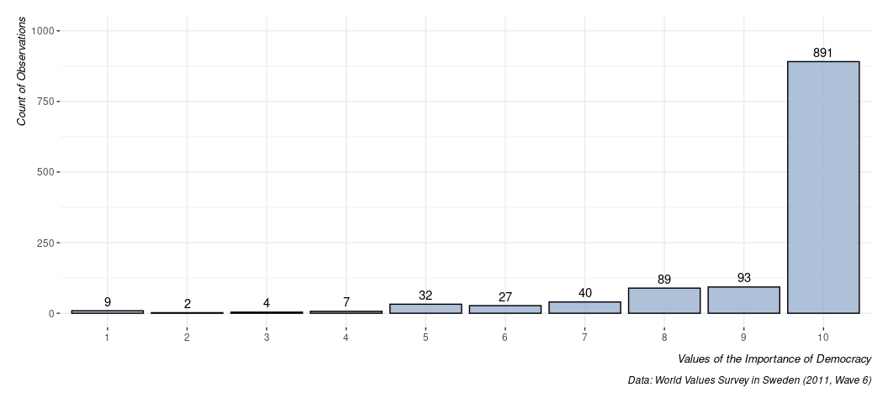
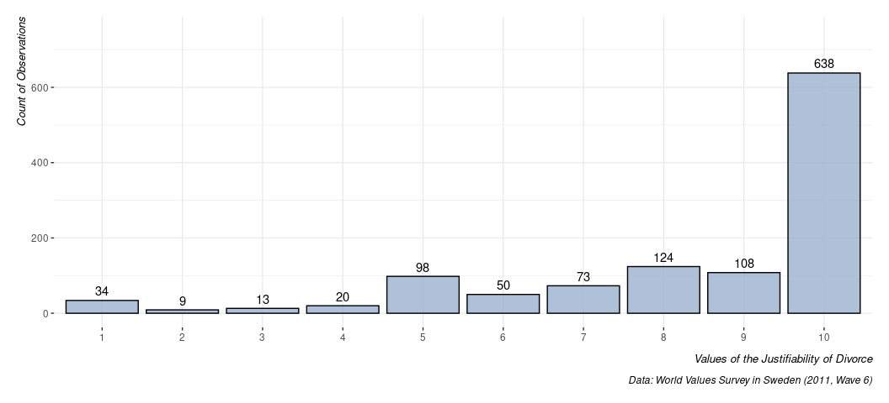

``` r
#     /\_/\           ___
#    = o_o =_______    \ \  -Model Presentation-
#     __^      __(  \.__) )
# (@)<_____>__(_____)____/
```

## If it’s not installed, install it.

``` r
library(tidyverse)
#> ── Attaching core tidyverse packages ──────────────────────── tidyverse 2.0.0 ──
#> ✔ dplyr     1.1.4     ✔ readr     2.1.4
#> ✔ forcats   1.0.1     ✔ stringr   1.5.0
#> ✔ ggplot2   4.0.0     ✔ tibble    3.2.1
#> ✔ lubridate 1.9.2     ✔ tidyr     1.3.0
#> ✔ purrr     1.1.0     
#> ── Conflicts ────────────────────────────────────────── tidyverse_conflicts() ──
#> ✖ dplyr::filter() masks stats::filter()
#> ✖ dplyr::lag()    masks stats::lag()
#> ℹ Use the conflicted package (<http://conflicted.r-lib.org/>) to force all conflicts to become errors
library(modelsummary)
library(stevethemes)

theme_set(theme_steve(style = 'generic'))
# library(kableExtra) # for extra formatting options, in this format.
# options("modelsummary_factory_default" = "kableExtra")
```

^ Note: “tinytable” (c.f. `{tinytable}`) is now default, though previous
versions of this were written around “kableExtra” (c.f. `{kableExtra}`).
As you develop your skills here (and importantly move away from
copy-pasting stuff into Word), you may want to more fully transition
into `{modelsummary}`’s default settings. However, we should keep this
tractable here. Also note that anyone viewing this on the public course
website will note that there are additional formatting things we should
be doing to make this presentable in that particular format. However,
what’s offered here is fine for the intended format. We’ll be doing
copy-pasting from RStudio into Word.

## Load the data

``` r
WVS <- readRDS("~/Koofr/teaching/eh1903-ir3/2/data/wvs-swe-6/wv6-sweden-v20201117.rds")
```

^ Note: you have access to this, but I won’t know where you put it on
your hard drive. You need to download it and load it.

Let’s grab the information I used in the example paper I wrote for you.
Here’s where I have to emphasize you need to read the codebook. The
codebook describes the variables included and tells you the basic
information they are communicating. You have to read the codebook,
whatever the codebook is.

``` r
WVS %>%
  select(
    #importance of democracy, justifiability of divorce
    V140, V205, 
    # age, sex, scale of incomes,
    V242, V240, V239, 
    # how often you pray, age completed education
    V146, V249) -> Data
```

^ read the codebook. It’ll tell you what you want.

Optional, but renames columns to be more informative. In most cases, you
should seriously think about doing this because a lot of variable names
in standing data sets are either vague or obscene to look at.

``` r
colnames(Data) <- c("impdem", "justdiv", "age", "sex", "inc", "pray", "educ")
```

Surveys typically make men to be 1 and women to be 2, but I’ve always
hated this practice. This makes women to be 1 and men to be 0.

``` r
Data %>% mutate(sex = ifelse(sex == 2, 1, 0)) -> Data

Data
#> # A tibble: 1,206 × 7
#>    impdem justdiv   age   sex   inc  pray  educ
#>     <dbl>   <dbl> <dbl> <dbl> <dbl> <dbl> <dbl>
#>  1     10      10    38     1     5     8    31
#>  2     10       4    51     1     5     3    29
#>  3      8      10    70     0     7     3    23
#>  4      6       1    21     1     6     2     6
#>  5     10      10    65     1     5     6    21
#>  6     10      10    51     1     5     2    32
#>  7     10      10    48     1     5     8    38
#>  8     10      10    81     0     7     8    27
#>  9      8      10    19     0     4     8    18
#> 10     10      10    61     0     8     8    18
#> # ℹ 1,196 more rows
```

Let’s run the linear models I described in the paper.

``` r
# First model
M1 <- lm(impdem ~ justdiv, Data)
# Full model
M2 <- lm(impdem ~ justdiv + age + sex + inc + pray + educ, Data)

summary(M1)
#> 
#> Call:
#> lm(formula = impdem ~ justdiv, data = Data)
#> 
#> Residuals:
#>     Min      1Q  Median      3Q     Max 
#> -8.4876  0.5124  0.5124  0.5993  1.2948 
#> 
#> Coefficients:
#>             Estimate Std. Error t value Pr(>|t|)    
#> (Intercept)  8.61826    0.15757  54.696  < 2e-16 ***
#> justdiv      0.08694    0.01807   4.811  1.7e-06 ***
#> ---
#> Signif. codes:  0 '***' 0.001 '**' 0.01 '*' 0.05 '.' 0.1 ' ' 1
#> 
#> Residual standard error: 1.428 on 1161 degrees of freedom
#>   (43 observations deleted due to missingness)
#> Multiple R-squared:  0.01955,    Adjusted R-squared:  0.0187 
#> F-statistic: 23.15 on 1 and 1161 DF,  p-value: 1.697e-06
summary(M2)
#> 
#> Call:
#> lm(formula = impdem ~ justdiv + age + sex + inc + pray + educ, 
#>     data = Data)
#> 
#> Residuals:
#>     Min      1Q  Median      3Q     Max 
#> -8.0004 -0.1078  0.3590  0.7373  2.0805 
#> 
#> Coefficients:
#>              Estimate Std. Error t value Pr(>|t|)    
#> (Intercept)  6.992661   0.267222  26.168  < 2e-16 ***
#> justdiv      0.095031   0.018053   5.264 1.70e-07 ***
#> age          0.018337   0.002236   8.202 6.59e-16 ***
#> sex          0.180965   0.084742   2.135  0.03294 *  
#> inc          0.056494   0.022731   2.485  0.01309 *  
#> pray        -0.006103   0.019008  -0.321  0.74820    
#> educ         0.013148   0.005088   2.584  0.00989 ** 
#> ---
#> Signif. codes:  0 '***' 0.001 '**' 0.01 '*' 0.05 '.' 0.1 ' ' 1
#> 
#> Residual standard error: 1.365 on 1091 degrees of freedom
#>   (108 observations deleted due to missingness)
#> Multiple R-squared:  0.1064, Adjusted R-squared:  0.1015 
#> F-statistic: 21.65 on 6 and 1091 DF,  p-value: < 2.2e-16
```

## Prepare a table of descriptive statistics of your data.

Papers make routine use of the table of descriptive statistics to
communicate some basic features about the data. this is easily done in
`{modelsummary}` with the `datasummary_skim()` function. The
`datasummary()` function in the same package has more flexibility but
this is easier to explain.

However, it comes with a few caveats that aren’t immediately obvious and
often change as the package is updated. I’ll talk about these here.

1.  It makes the most sense to whittle the data frame you’re using to
    *just* the information that you’re going to model. Real-world
    applications often have many more columns based on various
    transformations or robustness tests or what-not. It’s just easier to
    use `select()` here to grab only what you need.
2.  Related to the above, you may want to consider how you communicate
    the information about unique values and the percent missing and
    whether you want to pick just one to include. Technically, `NA` is a
    unique observation. Thus, a 1-10 scale would have 11 unique values
    for missing data. For ordinal measures that would be included in the
    minimum and maximum in a lot of applications. For something like a
    respondent’s age, do we care that there are 68 unique values of a
    respondent’s age? I’d probably suppress the “Unique” column if I
    were you. Alternatively, you can do the `na.omit` function on the
    data before feeding it to `datasummary_skim()` and omit the “Missing
    Pct.” column for presentation. I’m going to do the former here.
3.  It used to be the case, as far as I remember, that this function
    would only use the column names. Now, it can use variable labels (if
    you have them). I’ll actually show you how to overwrite one or
    supply one because the “sex” column doesn’t have one.
4.  It used to be easier to get a histogram with these data, which was
    nice for in-console presentation. Now, it’s more difficult to get
    that to behave the way I’d like for an audience like yours. It’s
    also something you really won’t be presenting anyway.
    `histogram = FALSE` used to be an argument you’d supply here. Now,
    it’s a bit more complicated.

Just trust me as I do this…

``` r
attr(Data$sex, "label") <- "Female"
attr(Data$pray, "label") <- "Frequency of Prayer"
attr(Data$educ, "label") <- "Age at End of Schooling"

Data %>% 
  # na.omit %>% # See second point above...
  # Below: feel free to copy-paste, but, explicitly, what goes before the = is
  # what the column is going to be named. You can also adjust this to taste in
  # Word or whatever...
  datasummary_skim(fun_numeric = list(N = N,
                                      `Missing %` = PercentMissing,
                                      Mean = Mean,
                                      `Std. Dev` = SD,
                                      Min = Min,
                                      Median = Median,
                                      Max = Max),
                   # Below: you may want to experiment with output = 'flextable'
                   output = 'tinytable') 
```

|                         | N    | Missing % | Mean | Std. Dev | Min  | Median | Max  |
|-------------------------|------|-----------|------|----------|------|--------|------|
| Importance of democracy | 1194 | 1         | 9.3  | 1.5      | 1.0  | 10.0   | 10.0 |
| Justifiable: Divorce    | 1167 | 3         | 8.4  | 2.3      | 1.0  | 10.0   | 10.0 |
| Age                     | 1206 | 0         | 47.3 | 19.4     | 18.0 | 47.0   | 85.0 |
| Female                  | 1206 | 0         | 0.5  | 0.5      | 0.0  | 1.0    | 1.0  |
| Scale of incomes        | 1166 | 3         | 5.4  | 1.8      | 1.0  | 5.0    | 10.0 |
| Frequency of Prayer     | 1188 | 1         | 6.4  | 2.3      | 1.0  | 8.0    | 8.0  |
| Age at End of Schooling | 1181 | 2         | 24.1 | 8.3      | 5.0  | 22.0   | 83.0 |

Be mindful that the data I supplied here are *all* numeric and the data
has *only* what I want to summarize. Be aware what you are asking it to
do. Looks nice, right? Let’s copy-paste it into a Word document. Some
cosmetic things you’ll have to do yourself (e.g. potential centering and
what-not). All you need is Ctrl-A, Ctrl-C, Ctrl-V (Cmd equivalent for
you Mac users). Don’t forget to add a title to the table. That is an
argument in this function, but it’s only applicable (as I understand) to
in-chunk stuff processed by {knitr} or R Markdown. That’s likely not
you, but it’s a good reason to learn how to do this.

## Make a plot or two or three

For what it’s worth, this descriptive statistics table is pointing you
to potential issues you can encounter in your data. In this particular
example, I see several things I’ll want to consider. For one, I see an
överliggare there who said they finished schooling at 83 (which, fam…).
I see that there is huge problems of left-skew. Most Swedes maximally
value democracy, are maximally permissive about divorce, and don’t pray
at all (per the codebook). I can already anticipate these are going to
be issues I should at least acknowledge because I can suspect they’re
going to point me to problems in my linear model.

At the least, I can offer a visual display of these. A bar chart should
suffice.

``` r
Data %>%
  select(impdem) %>%
  na.omit %>%
  ggplot(.,aes(factor(impdem))) +
  geom_bar(fill="#9bb2ce", alpha=.8, color='black') +
  geom_text(aes(label = after_stat(count)), stat = "count", vjust = -0.5)  +
  labs(caption = "Data: World Values Survey in Sweden (2011, Wave 6)",
       x = "Values of the Importance of Democracy",
       y = "Count of Observations") +
  scale_y_continuous(limits = c(0,1000))
```

<!-- -->

Issues in the dependent variable will typically be the ones you should
think about first and the most, but you can see these issues manifest
elsewhere.

``` r
Data %>%
  select(justdiv) %>%
  na.omit %>%
  ggplot(.,aes(factor(justdiv))) +
  geom_bar(fill="#9bb2ce", alpha=.8, color='black') +
  geom_text(aes(label = after_stat(count)), stat = "count", vjust = -0.5)  +
  labs(caption = "Data: World Values Survey in Sweden (2011, Wave 6)",
       x = "Values of the Justifiability of Divorce",
       y = "Count of Observations") +
  scale_y_continuous(limits = c(0,750))
```

<!-- -->

Now that you’ve created a graph that summarizes important features about
your data, save it (in RStudio) to a PNG file. Then, in your Word
document, grab it and move it in. You can also—if it pleases and
sparkles—zoom into the plot, right-click, copy image, and paste it into
your Word document. Choice is yours.

## Create a regression table

To really impress me, you’ll need to have a regression table that
summarizes the results, and that summary cannot (well, really, really
should not) be a PrtScrn job. You should get comfortable with the
`modelsummary()` function in R.

Its basic form looks something like this.

``` r
modelsummary(list(M1, M2))
```

<table style="width:53%;">
<colgroup>
<col style="width: 19%" />
<col style="width: 16%" />
<col style="width: 16%" />
</colgroup>
<thead>
<tr>
<th></th>
<th><ol type="1">
<li></li>
</ol></th>
<th><ol start="2" type="1">
<li></li>
</ol></th>
</tr>
</thead>
<tbody>
<tr>
<td>(Intercept)</td>
<td>8.618</td>
<td>6.993</td>
</tr>
<tr>
<td></td>
<td>(0.158)</td>
<td>(0.267)</td>
</tr>
<tr>
<td>justdiv</td>
<td>0.087</td>
<td>0.095</td>
</tr>
<tr>
<td></td>
<td>(0.018)</td>
<td>(0.018)</td>
</tr>
<tr>
<td>age</td>
<td></td>
<td>0.018</td>
</tr>
<tr>
<td></td>
<td></td>
<td>(0.002)</td>
</tr>
<tr>
<td>sex</td>
<td></td>
<td>0.181</td>
</tr>
<tr>
<td></td>
<td></td>
<td>(0.085)</td>
</tr>
<tr>
<td>inc</td>
<td></td>
<td>0.056</td>
</tr>
<tr>
<td></td>
<td></td>
<td>(0.023)</td>
</tr>
<tr>
<td>pray</td>
<td></td>
<td>-0.006</td>
</tr>
<tr>
<td></td>
<td></td>
<td>(0.019)</td>
</tr>
<tr>
<td>educ</td>
<td></td>
<td>0.013</td>
</tr>
<tr>
<td></td>
<td></td>
<td>(0.005)</td>
</tr>
<tr>
<td>Num.Obs.</td>
<td>1163</td>
<td>1098</td>
</tr>
<tr>
<td>R2</td>
<td>0.020</td>
<td>0.106</td>
</tr>
<tr>
<td>R2 Adj.</td>
<td>0.019</td>
<td>0.101</td>
</tr>
<tr>
<td>AIC</td>
<td>4132.9</td>
<td>3808.4</td>
</tr>
<tr>
<td>BIC</td>
<td>4148.1</td>
<td>3848.4</td>
</tr>
<tr>
<td>Log.Lik.</td>
<td>-2063.469</td>
<td>-1896.218</td>
</tr>
<tr>
<td>RMSE</td>
<td>1.43</td>
<td>1.36</td>
</tr>
</tbody>
</table>

Notice here that `modelsummary()` works best with list types, and lists
are just super-flexible ways of corralling a diverse set of object types
in R. Here, we have two regression summaries (`M1`, `M2`). We’re
wrapping them in a `list()`. `modelsummary()` will do what it does with
them.

There’s a lot we should really think about doing here. First, it may be
useful to so-called “name” your regressions. In my sample paper, `M1` is
a simple bivariate linear model and `M2` adds the control variables. I
can name them within `list()` like this.

``` r
modelsummary(list("Bivariate Regression" = M1,
                  "Full Model" = M2))
```

|             | Bivariate Regression | Full Model |
|-------------|----------------------|------------|
| (Intercept) | 8.618                | 6.993      |
|             | (0.158)              | (0.267)    |
| justdiv     | 0.087                | 0.095      |
|             | (0.018)              | (0.018)    |
| age         |                      | 0.018      |
|             |                      | (0.002)    |
| sex         |                      | 0.181      |
|             |                      | (0.085)    |
| inc         |                      | 0.056      |
|             |                      | (0.023)    |
| pray        |                      | -0.006     |
|             |                      | (0.019)    |
| educ        |                      | 0.013      |
|             |                      | (0.005)    |
| Num.Obs.    | 1163                 | 1098       |
| R2          | 0.020                | 0.106      |
| R2 Adj.     | 0.019                | 0.101      |
| AIC         | 4132.9               | 3808.4     |
| BIC         | 4148.1               | 3848.4     |
| Log.Lik.    | -2063.469            | -1896.218  |
| RMSE        | 1.43                 | 1.36       |

Next—and really important—thing I want to do is add asterisks to help me
identify so-called statistical significance. There are some
customization options here, but just add `stars = TRUE` here.

``` r
modelsummary(list("Bivariate Regression" = M1,
                  "Full Model" = M2),
             stars  = TRUE)
```

<table style="width:69%;">
<colgroup>
<col style="width: 19%" />
<col style="width: 31%" />
<col style="width: 18%" />
</colgroup>
<thead>
<tr>
<th></th>
<th>Bivariate Regression</th>
<th>Full Model</th>
</tr>
</thead>
<tbody>
<tr>
<td>(Intercept)</td>
<td>8.618***</td>
<td>6.993***</td>
</tr>
<tr>
<td></td>
<td>(0.158)</td>
<td>(0.267)</td>
</tr>
<tr>
<td>justdiv</td>
<td>0.087***</td>
<td>0.095***</td>
</tr>
<tr>
<td></td>
<td>(0.018)</td>
<td>(0.018)</td>
</tr>
<tr>
<td>age</td>
<td></td>
<td>0.018***</td>
</tr>
<tr>
<td></td>
<td></td>
<td>(0.002)</td>
</tr>
<tr>
<td>sex</td>
<td></td>
<td>0.181*</td>
</tr>
<tr>
<td></td>
<td></td>
<td>(0.085)</td>
</tr>
<tr>
<td>inc</td>
<td></td>
<td>0.056*</td>
</tr>
<tr>
<td></td>
<td></td>
<td>(0.023)</td>
</tr>
<tr>
<td>pray</td>
<td></td>
<td>-0.006</td>
</tr>
<tr>
<td></td>
<td></td>
<td>(0.019)</td>
</tr>
<tr>
<td>educ</td>
<td></td>
<td>0.013**</td>
</tr>
<tr>
<td></td>
<td></td>
<td>(0.005)</td>
</tr>
<tr>
<td>Num.Obs.</td>
<td>1163</td>
<td>1098</td>
</tr>
<tr>
<td>R2</td>
<td>0.020</td>
<td>0.106</td>
</tr>
<tr>
<td>R2 Adj.</td>
<td>0.019</td>
<td>0.101</td>
</tr>
<tr>
<td>AIC</td>
<td>4132.9</td>
<td>3808.4</td>
</tr>
<tr>
<td>BIC</td>
<td>4148.1</td>
<td>3848.4</td>
</tr>
<tr>
<td>Log.Lik.</td>
<td>-2063.469</td>
<td>-1896.218</td>
</tr>
<tr>
<td>RMSE</td>
<td>1.43</td>
<td>1.36</td>
</tr>
</tbody><tfoot>
<tr>
<td colspan="3"><ul>
<li>p &lt; 0.1, * p &lt; 0.05, ** p &lt; 0.01, *** p &lt; 0.001</li>
</ul></td>
</tr>
</tfoot>
&#10;</table>

Next, and also really important, thing I want to do is rename the
variables to be something intuitive. This is the `coef_map` argument in
`modelsummary()`. Of note: it will help you to build the simple version
above so you know what you’re looking at. In `coef_map`, there’s a `c()`
function that takes arguments effectively communicating that “what the
thing is called in the model, on the left, is going to be called this
new thing, on the right”. `justdiv` is my main independent variable, but
“Justifiability of Divorce” is what I want to call it.

``` r
modelsummary(list("Bivariate Regression" = M1,
                  "Full Model" = M2),
             stars  = TRUE,
             coef_map = c("justdiv" = "Justifiability of Divorce",
                          "age" = "Age",
                          "educ" = "Age at End of Schooling",
                          "sex" = "Female",
                          "pray" = "Frequency of Prayer",
                          "inc" = "Scale of Incomes",
                          "(Intercept)" = "Intercept"))
```

<table style="width:89%;">
<colgroup>
<col style="width: 38%" />
<col style="width: 31%" />
<col style="width: 18%" />
</colgroup>
<thead>
<tr>
<th></th>
<th>Bivariate Regression</th>
<th>Full Model</th>
</tr>
</thead>
<tbody>
<tr>
<td>Justifiability of Divorce</td>
<td>0.087***</td>
<td>0.095***</td>
</tr>
<tr>
<td></td>
<td>(0.018)</td>
<td>(0.018)</td>
</tr>
<tr>
<td>Age</td>
<td></td>
<td>0.018***</td>
</tr>
<tr>
<td></td>
<td></td>
<td>(0.002)</td>
</tr>
<tr>
<td>Age at End of Schooling</td>
<td></td>
<td>0.013**</td>
</tr>
<tr>
<td></td>
<td></td>
<td>(0.005)</td>
</tr>
<tr>
<td>Female</td>
<td></td>
<td>0.181*</td>
</tr>
<tr>
<td></td>
<td></td>
<td>(0.085)</td>
</tr>
<tr>
<td>Frequency of Prayer</td>
<td></td>
<td>-0.006</td>
</tr>
<tr>
<td></td>
<td></td>
<td>(0.019)</td>
</tr>
<tr>
<td>Scale of Incomes</td>
<td></td>
<td>0.056*</td>
</tr>
<tr>
<td></td>
<td></td>
<td>(0.023)</td>
</tr>
<tr>
<td>Intercept</td>
<td>8.618***</td>
<td>6.993***</td>
</tr>
<tr>
<td></td>
<td>(0.158)</td>
<td>(0.267)</td>
</tr>
<tr>
<td>Num.Obs.</td>
<td>1163</td>
<td>1098</td>
</tr>
<tr>
<td>R2</td>
<td>0.020</td>
<td>0.106</td>
</tr>
<tr>
<td>R2 Adj.</td>
<td>0.019</td>
<td>0.101</td>
</tr>
<tr>
<td>AIC</td>
<td>4132.9</td>
<td>3808.4</td>
</tr>
<tr>
<td>BIC</td>
<td>4148.1</td>
<td>3848.4</td>
</tr>
<tr>
<td>Log.Lik.</td>
<td>-2063.469</td>
<td>-1896.218</td>
</tr>
<tr>
<td>RMSE</td>
<td>1.43</td>
<td>1.36</td>
</tr>
</tbody><tfoot>
<tr>
<td colspan="3"><ul>
<li>p &lt; 0.1, * p &lt; 0.05, ** p &lt; 0.01, *** p &lt; 0.001</li>
</ul></td>
</tr>
</tfoot>
&#10;</table>

Just as an FYI, this works in order you specify them (i.e. the `justdiv`
variable is displayed first here) and if you don’t specify it, it gets
dropped from the summary (i.e. check for typos!).

Finally, it’s worth clarifying that `modelsummary()` returns almost all
goodness of fit statistic for the model (contingent on the model type)
and there are often *lots* of these. You don’t need all of them. In the
simple linear model, you really just want information about the number
of observations at a minimum, and maybe one or both of the R-squares.

Use the `gof_map` argument to specify what you want. If you don’t know
what they’re called, use `broom::glance()` to see what they’re called
internally.

``` r
broom::glance(M2)
#> # A tibble: 1 × 12
#>   r.squared adj.r.squared sigma statistic  p.value    df logLik   AIC   BIC
#>       <dbl>         <dbl> <dbl>     <dbl>    <dbl> <dbl>  <dbl> <dbl> <dbl>
#> 1     0.106         0.101  1.37      21.7 3.89e-24     6 -1896. 3808. 3848.
#> # ℹ 3 more variables: deviance <dbl>, df.residual <int>, nobs <int>

# I want, in order, "nobs", "r.squared", and "adj.r.squared".
modelsummary(list("Bivariate Regression" = M1,
                  "Full Model" = M2),
             stars  = TRUE,
             coef_map = c("justdiv" = "Justifiability of Divorce",
                          "age" = "Age",
                          "educ" = "Age at End of Schooling",
                          "sex" = "Female",
                          "pray" = "Frequency of Prayer",
                          "inc" = "Scale of Incomes",
                          "(Intercept)" = "Intercept"),
             gof_map = c("nobs", "adj.r.squared", "r.squared"))
```

<table style="width:89%;">
<colgroup>
<col style="width: 38%" />
<col style="width: 31%" />
<col style="width: 18%" />
</colgroup>
<thead>
<tr>
<th></th>
<th>Bivariate Regression</th>
<th>Full Model</th>
</tr>
</thead>
<tbody>
<tr>
<td>Justifiability of Divorce</td>
<td>0.087***</td>
<td>0.095***</td>
</tr>
<tr>
<td></td>
<td>(0.018)</td>
<td>(0.018)</td>
</tr>
<tr>
<td>Age</td>
<td></td>
<td>0.018***</td>
</tr>
<tr>
<td></td>
<td></td>
<td>(0.002)</td>
</tr>
<tr>
<td>Age at End of Schooling</td>
<td></td>
<td>0.013**</td>
</tr>
<tr>
<td></td>
<td></td>
<td>(0.005)</td>
</tr>
<tr>
<td>Female</td>
<td></td>
<td>0.181*</td>
</tr>
<tr>
<td></td>
<td></td>
<td>(0.085)</td>
</tr>
<tr>
<td>Frequency of Prayer</td>
<td></td>
<td>-0.006</td>
</tr>
<tr>
<td></td>
<td></td>
<td>(0.019)</td>
</tr>
<tr>
<td>Scale of Incomes</td>
<td></td>
<td>0.056*</td>
</tr>
<tr>
<td></td>
<td></td>
<td>(0.023)</td>
</tr>
<tr>
<td>Intercept</td>
<td>8.618***</td>
<td>6.993***</td>
</tr>
<tr>
<td></td>
<td>(0.158)</td>
<td>(0.267)</td>
</tr>
<tr>
<td>Num.Obs.</td>
<td>1163</td>
<td>1098</td>
</tr>
<tr>
<td>R2 Adj.</td>
<td>0.019</td>
<td>0.101</td>
</tr>
<tr>
<td>R2</td>
<td>0.020</td>
<td>0.106</td>
</tr>
</tbody><tfoot>
<tr>
<td colspan="3"><ul>
<li>p &lt; 0.1, * p &lt; 0.05, ** p &lt; 0.01, *** p &lt; 0.001</li>
</ul></td>
</tr>
</tfoot>
&#10;</table>

Finally, you may want to add a caption that explains that this a
regression table. You’ll want to call it something better than what I
call it here.

``` r
modelsummary(list("Bivariate Regression" = M1,
                  "Full Model" = M2),
             stars  = TRUE,
             coef_map = c("justdiv" = "Justifiability of Divorce",
                          "age" = "Age",
                          "educ" = "Age at End of Schooling",
                          "sex" = "Female",
                          "pray" = "Frequency of Prayer",
                          "inc" = "Scale of Incomes",
                          "(Intercept)" = "Intercept"),
             gof_map = c("nobs", "adj.r.squared", "r.squared"),
             title = "Hi Mom!")
```

<table style="width:89%;">
<caption>Hi Mom!</caption>
<colgroup>
<col style="width: 38%" />
<col style="width: 31%" />
<col style="width: 18%" />
</colgroup>
<thead>
<tr>
<th></th>
<th>Bivariate Regression</th>
<th>Full Model</th>
</tr>
</thead>
<tbody>
<tr>
<td>Justifiability of Divorce</td>
<td>0.087***</td>
<td>0.095***</td>
</tr>
<tr>
<td></td>
<td>(0.018)</td>
<td>(0.018)</td>
</tr>
<tr>
<td>Age</td>
<td></td>
<td>0.018***</td>
</tr>
<tr>
<td></td>
<td></td>
<td>(0.002)</td>
</tr>
<tr>
<td>Age at End of Schooling</td>
<td></td>
<td>0.013**</td>
</tr>
<tr>
<td></td>
<td></td>
<td>(0.005)</td>
</tr>
<tr>
<td>Female</td>
<td></td>
<td>0.181*</td>
</tr>
<tr>
<td></td>
<td></td>
<td>(0.085)</td>
</tr>
<tr>
<td>Frequency of Prayer</td>
<td></td>
<td>-0.006</td>
</tr>
<tr>
<td></td>
<td></td>
<td>(0.019)</td>
</tr>
<tr>
<td>Scale of Incomes</td>
<td></td>
<td>0.056*</td>
</tr>
<tr>
<td></td>
<td></td>
<td>(0.023)</td>
</tr>
<tr>
<td>Intercept</td>
<td>8.618***</td>
<td>6.993***</td>
</tr>
<tr>
<td></td>
<td>(0.158)</td>
<td>(0.267)</td>
</tr>
<tr>
<td>Num.Obs.</td>
<td>1163</td>
<td>1098</td>
</tr>
<tr>
<td>R2 Adj.</td>
<td>0.019</td>
<td>0.101</td>
</tr>
<tr>
<td>R2</td>
<td>0.020</td>
<td>0.106</td>
</tr>
</tbody><tfoot>
<tr>
<td colspan="3"><ul>
<li>p &lt; 0.1, * p &lt; 0.05, ** p &lt; 0.01, *** p &lt; 0.001</li>
</ul></td>
</tr>
</tfoot>
&#10;</table>

Dope, let’s put it in our Word document. In RStudio, click on that
viewer of the table. Then: Ctrl-A, Ctrl-C, Ctrl-V into your Word
document. For you Mac users, this should be Cmd instead of Ctrl.
